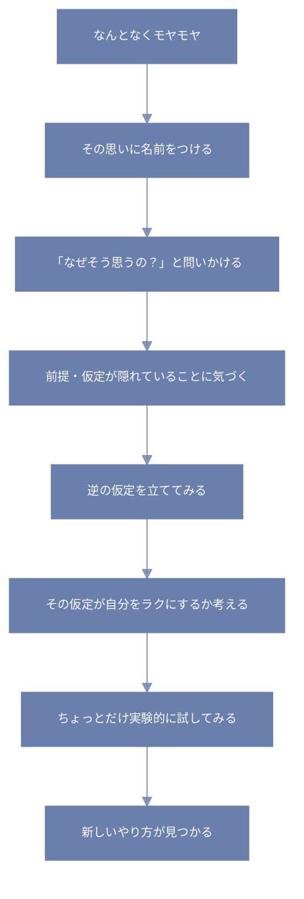

前提とか仮定って言われても、ちょっと堅い感じするけど、  
日常でもけっこう「それって本当にそう？」って問い直すだけで、気持ちが軽くなったりするんだよね。

たとえば──

---

## 🍳 「料理、私が毎日やらなきゃ」って思ってない？

疲れて帰ってきた夜、「今日も夕飯作らなきゃ…」って思う瞬間ってない？  
でもちょっとだけ立ち止まって、「それって本当に“私が”“毎日”やらなきゃいけない前提？」って問い直してみる。

- たとえば「夫の方が先に帰るなら、彼が作ってもいいんじゃない？」
- 「週3回だけでも外食や冷凍食品でOKって決めたらどう？」
- 「子どもが高校生なら、任せてもいい日を作れない？」

こういう“問い直し”って、ちょっと心をゆるめてくれる。

---

## 🧠 無意識にある「思い込みフィルター」

人の頭の中には、ほんとうにたくさんの前提が隠れてる。

- 「真面目にやらないと、誰かに怒られる」
- 「ちゃんとしなきゃ、大人として失格」
- 「家族を支えるのが自分の責任」

これ、ぜんぶ“無意識の仮定”だったりする。

でもね、それってほんとに絶対？  
ちょっと逆から見てみると、こんなふうにも言えるかも。

- 「たまにはズルしても、世界はちゃんと回ってる」
- 「ちゃんとしてる風に見える人も、裏ではけっこう抜いてる」
- 「誰かを支えるには、まず自分が倒れない方がだいじ」

---

## 🔄 逆の仮定で考えてみる

これは「前提をひっくり返してみる」っていうコツ。

たとえば…

- 仮定①：**「家事は完璧にこなすべき」**  
  → 逆：「家事はほどほどでも、誰も困らない」

- 仮定②：**「勉強は毎日コツコツ続けるもの」**  
  → 逆：「がっつりやる日が週2でも、意外と覚えてる」

- 仮定③：**「迷惑をかけないように生きるべき」**  
  → 逆：「迷惑をかけ合って、生きていくのが人間」

この“逆から見てみる”だけで、頭の中のしんどさがほぐれることがある。

---

## 🌱「これって前提かも？」と気づく練習

最初からすべての仮定に気づくのはむずかしい。  
でもちょっとずつ、こうやって問いかけてみると練習になるかも。

- 「それ、ほんとに私がやるべき？」
- 「なんでそう思ったんだっけ？」
- 「もし〇〇だったらどうなる？」

思考をやわらかく保つって、なんだか自分を守ることにもつながるんだ。

```python
# モヤモヤを感じたときの思考処理フロー

入力: 思っていること → thought

関数: 仮定を見つける(thought)
    もし thought に「〜しなきゃ」「〜すべき」などの言葉があれば
        → その背後にある仮定を取り出す
    なければ → 何も返さない

関数: 仮定を反転する(assumption)
    → 「もし◯◯じゃなくてもいいとしたら？」という問いをつくる

関数: 反転した仮定を想像する(alt_assumption)
    → それが現実的かどうか、心の中でシミュレーションする

関数: 小さく試してみる(alt_assumption)
    → 一度だけ軽くやってみる
    → 「気持ちが軽くなった？」「問題は起きなかった？」をチェック

関数: 採用するか決める(result)
    → 軽くなっていれば「新しいやり方」として採用
    → モヤモヤが増えるなら保留

処理の流れ:

thought = モヤモヤしていることを入力

assumption = 仮定を見つける(thought)

もし assumption があれば:
    alt = 仮定を反転する(assumption)
    仮定を想像する(alt)
    result = 小さく試してみる(alt)
    採用するか決める(result)
そうでなければ:
    「今回は仮定が見つからなかった」とメモ
```

---

## 🪷まとめ：前提に気づけると、選択肢がふえる

前提とか仮定って、“見えないメガネ”みたいなもので、  
知らず知らずのうちに、ものごとの見え方を決めちゃってる。

でも、そのメガネに気づいて外してみると、  
「あれ？ こんな選択肢もあったのか」って、ちょっと世界が広がる。

たとえば…



ちょっと論理っぽく見てみよう

```prolog
# 思考の柔軟性を高める仮定反転のプロセス

状態(出発点, モヤモヤしている).

% モヤモヤの原因を特定する
原因を探す(モヤモヤしている, 「〜しなきゃ」や「〜すべき」の思い).

% 仮定を見つける
仮定を発見(「〜しなきゃ」, 「私は○○であるべき」).

% 仮定を逆にしてみる
逆仮定(「私は○○であるべき」, 「○○でなくても、だいじょうぶ」).

% 仮定をテストしてみる
試す(逆仮定, 小さな行動).

% 自分に合うなら取り入れる
採用する(逆仮定, 気持ちが軽くなった場合).
```
