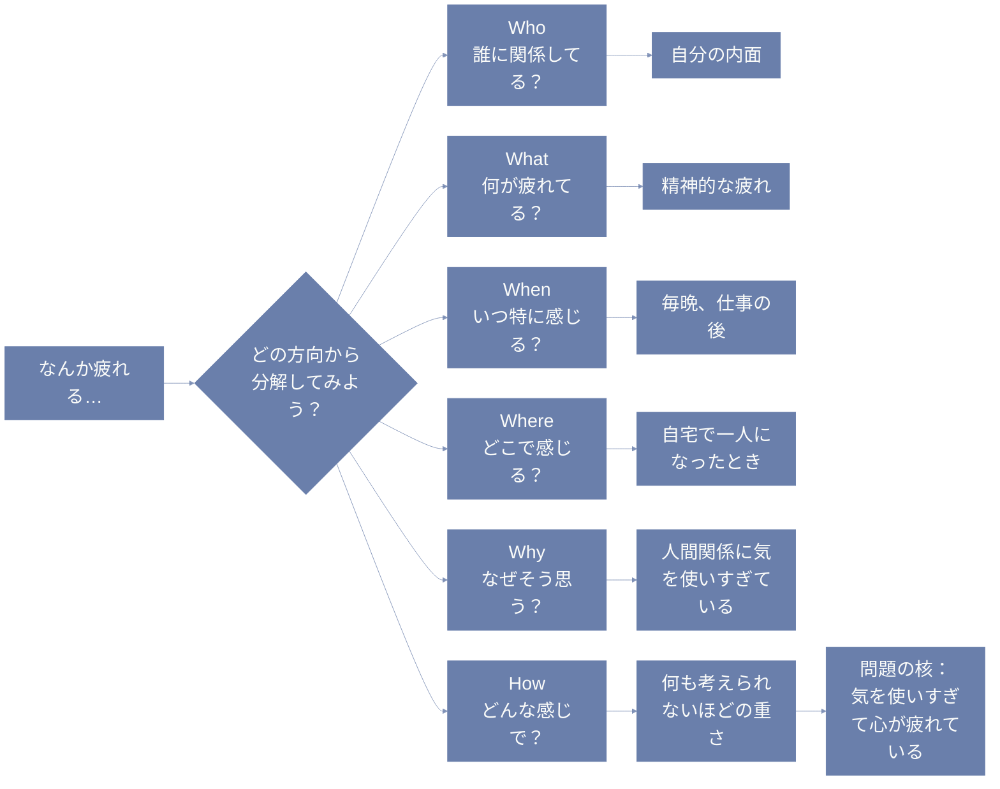

# はじめに

「なんかうまくいかない…」「なんでこんなに悩むんだろう…」  
そんなときって、実は“何に悩んでるのか”が自分でもよく分かってないこと、多くない？

ぼく自身もよくあるんだけど、  
たとえば「やる気が出ないなあ…」って思ってたのに、  
よくよく整理してみたら「やるべきことが多すぎて優先順位がつけられなかっただけ」だった、みたいな。

今回はそんな “もやもや” をスッキリさせる、  
**クリティカルシンキングの最初のステップ**、「問題の明確化」について、  
日常に寄せてやさしく書いていこうと思うよ。

---

# 「問題の明確化」って、どういうこと？

ちょっとカタい言葉に見えるかもしれないけど、  
イメージとしてはこう。

> ✅ 「いま自分は何に困っていて、何をどうしたいのか？」をちゃんと見つけてあげること

問題って、だいたい最初はぼんやりしてる。  
そのまま話を進めたり、誰かに相談しても、  
「うーん…で、結局何が問題？」って聞かれちゃったりする。

でも、逆に言えば、  
**ここがはっきりすれば、だいぶ見通しがよくなる**んだよね。

---

# 例：ある日のぼんやりしたつぶやき

> 「最近、なんか疲れるんだよなあ…」

これ、よくあるセリフだけど、  
「なんか」って便利なようで、実は正体不明のままにしちゃうワード。

このままだと対策も取りにくいし、  
誰かに相談しても「とりあえず寝たら？」って言われちゃったりする。

---

# 🛠 そんなときに使えるのが「5W1H」

**5W1H**（Who, What, When, Where, Why, How）って、  
学生時代に習った気がするけど、  
実は思考を整理するときにもすごく役立つ道具なんだよね。

これを「もやもやワード」に当てはめていくと、  
少しずつ、ふんわりした気持ちの輪郭が見えてくる。

---

## 例：「なんか疲れる」を分解してみる

| 質問 | 考えてみること |
|------|----------------|
| Who（誰が？） | 自分？まわりの誰か？家族？同僚？ |
| What（何が？） | 体？心？気力？責任？ |
| When（いつ？） | 朝？昼？夜？特定の曜日？ |
| Where（どこで？） | 家？職場？移動中？ |
| Why（なぜ？） | 何が原因っぽい？思い当たることは？ |
| How（どんなふうに？） | どれくらいの頻度で？どんな感じの疲れ？ |

この問いかけを順番に考えていくと、  
「最近疲れる」→「夜になると心がずーんと重たくなる」→  
「仕事のやりとりで気を遣いすぎてるかも」みたいに、  
**“本当の問題” がちょっとずつ見えてくる**。

---

**フローチャート**


**疑似言語**
```
# 疲れを感じるときの問題の明確化プロセス

function clarifyProblem(feeling):
    # 入力は「なんか疲れる」というぼんやり感覚

    # 5W1Hを順番にチェックする
    who = ask("誰が関係してる？")
    what = ask("何が疲れてる？")
    when = ask("いつ特に疲れを感じる？")
    where = ask("どこで疲れを感じる？")
    why = ask("なぜそう感じる？")
    how = ask("どんなふうに感じる？")

    # 得られた答えを基に問題を組み立てる
    if who == "自分" and what == "心" and when == "夜" and why == "気を使いすぎ":
        problem = "気疲れで心が疲れている"
    else:
        problem = "もう少し詳しく考えてみよう"

    return problem

# 実行例
feeling = "なんか疲れる"
result = clarifyProblem(feeling)
print("問題の本質は:", result)
```

**prolog**
```prolog
% 疲れを感じる状況を表すルール

疲れ(心) :-
    誰(自分),
    何(心),
    いつ(夜),
    どこ(自宅),
    なぜ(気を使いすぎている).

誰(自分).
何(心).
いつ(夜).
どこ(自宅).
なぜ(気を使いすぎている).

% 疲れの本質を確認するルール
問題の本質(気疲れ) :-
    疲れ(心).

% 疑問を投げかける関数（対話イメージ）
質問(質問文, 答え) :-
    format("質問: ~w\n", [質問文]),
    答え = yes. % 実際はここで対話や入力を想定

% 疲れの診断
診断 :-
    質問("誰が疲れてる？", 誰),
    質問("何が疲れてる？", 何),
    質問("いつ疲れてる？", いつ),
    質問("どこで疲れてる？", どこ),
    質問("なぜ疲れてる？", なぜ),
    (問題の本質(気疲れ) -> format("問題の本質は「気疲れ」です。\n") ; format("もう少し調べてみましょう。\n")).
```

---

# 🌀 よくある落とし穴とコツ

## ❌ 最初から「これが問題だ」と決めつけちゃう

ぼくもよくやっちゃうんだけど、  
「これは○○のせいに違いない！」って最初に思い込むと、  
その後の思考がぜんぶその前提に引っ張られちゃう。

でも実は、まったく別のところに原因があった…なんてことも。

だから、**いったん思い込みは横に置いて、広く問いを立てる**のがコツ。

---

## 🧩 問題が“入れ子”になってる場合もある

「疲れる」の原因が「やることが多い」  
→ その原因が「予定の優先順位がついてない」  
→ さらに「人の頼みを断れない」…って感じで、  
**“問題の構造”が何層にもなってることも多い**。

こういうときは、  
「それって、なんで？」って自分にもう一回聞いてみる。  
すると、だんだん“根っこ”のほうに近づいていけるよ。

---

## 💬 問題じゃなくて“感情”が前に出てるケースもある

たとえば、

> 「もう無理」  
> 「イライラする」  
> 「どうでもよくなった」

こういう言葉って、たしかに気持ちの表現ではあるけど、  
「何がどう無理なのか」「何に対してイライラしてるのか」が、  
分からないままだと、ずっと気持ちだけがしんどくなる。

そんなときも、5W1Hをひとつひとつ当ててみると、  
**感情の“後ろに隠れてた本当の困りごと”** が見えてくる。

---

# ☕ おわりに

問題を明確にするって、  
すごく地味だし、ちょっとめんどくさいと感じるかもしれない。

でもね、ここがボヤけたままだと、  
どんなにがんばっても、効果が薄かったり、ズレた対応になっちゃう。

逆に、ここがちゃんと整理できてると、  
不思議なくらい気持ちが軽くなるし、  
「じゃあどうしよう？」っていう次のステップが自然と見えてくるんだよね。
