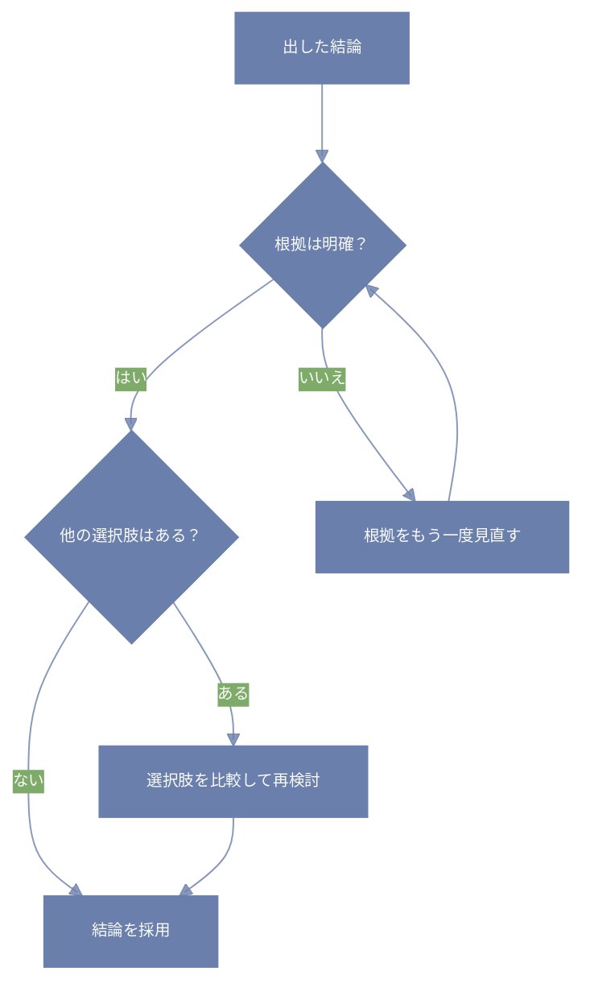

よく考えて出した「答え」って、つい安心しちゃうことない？

「よし、これで完了！」
「これが正解っぽいな〜」
って思った瞬間、もうそこで頭のエンジン止まっちゃう。

でもね、
それって意外と「まだ早かったかも」ってこと、あるんだ。

---

## 🪞結論の評価って、なにするの？

簡単に言えば、
> 「出した結論って、本当に合ってる？」  
> 「他にもっとマシな道、あるかもよ？」

って、自分にもう一回聞いてみること。

「疑う」って言葉にすると、ちょっとトゲがあるかもだけど、
ここでやりたいのは「よりいい選択肢を見つけるための見直し」みたいな感じ。

---

## 🌱 ありがちな「早とちりパターン」

たとえば……

- 「安いから買った」 → 実は使いづらくてムダに
- 「疲れたから休む」 → 気分が落ちてさらにダウン
- 「Aさんが正しいって言ってた」 → 自分の状況には合ってなかった

どれも、**一見よさそう**に見えるけど、  
あとから「うーん、ちょっと違ったかも…」ってなるパターン。

---

## 📌 どうやって評価すればいいの？

結論を評価するときのチェックポイント、いくつかあるよ。

### 🔹 ① 証拠とのつながりを確認  
「この結論って、ちゃんと理由とつながってる？」  
→ ふんわり納得じゃなくて、根拠がちゃんとある？

### 🔹 ② 他の可能性も見てみる  
「別の方向から考えたら、もっといい答えあるかも？」  
→ ちょっと視野を広げてみる。

### 🔹 ③ “気持ちの勢い”がないか確認  
「疲れてたからそう思っただけかも？」  
→ 感情に振り回されてないか、ちょっと冷静に。

### 🔹 図や疑似言語で理解を深める


```python:python
def 結論を評価する(結論):
    print(f"今の結論は「{結論}」だよ")

    # 根拠を調べる
    根拠が十分か = 根拠を確認する(結論)
    if not 根拠が十分か:
        print("根拠が弱いから、もう一度よく調べてみよう")
        根拠を集め直す(結論)

    # 他の選択肢を探す
    選択肢リスト = 他の選択肢を探す(結論)
    if 選択肢リスト:
        print("他にも選べる道があるかも。比べてみようね")
        結論 = 選択肢を比べて決める([結論] + 選択肢リスト)
    else:
        print("他の選択肢はなさそう。今の結論で進もう")

    print(f"最終的な結論は「{結論}」に決定！")
    return 結論


# 補助的なイメージ関数
def 根拠を確認する(結論):
    # 根拠が十分かどうかを調べてTrue/Falseを返す
    pass

def 根拠を集め直す(結論):
    # もう一度情報を集め直す
    pass

def 他の選択肢を探す(結論):
    # 他に考えられる選択肢を探してリストで返す
    pass

def 選択肢を比べて決める(選択肢リスト):
    # 比較して一番いいものを選ぶ
    pass
```

```prolog:prolog
結論(結論内容) :- 
    根拠(十分),
    他の選択肢(ない),
    結論採用(結論内容).

結論(結論内容) :-
    根拠(弱い),
    根拠再検討,
    結論(結論内容).

結論(結論内容) :-
    他の選択肢(ある),
    選択肢比較,
    最良の結論(新しい結論),
    結論(新しい結論).
```

---

## ☁️ こんなふうに見直してみよう

ちょっとした「問い直し」を入れるだけで、  
結論の質ってぐっと上がる。

### 🌼 例）早く帰りたい日

> 結論：「今日はもうやめて帰る」

- ❓ 理由は？ → 眠い・集中できない
- ❓ それって一時的？ → ごはん食べたら回復するかも
- ❓ 他の選択肢は？ → 30分だけ作業→カフェでご褒美でもOK？

こうやって考えると、「帰る」だけじゃなくて、  
ちょっと工夫した選択肢も出てくるよね。

---

## 🧩 まとめ：結論こそ、やさしく見直す

決めたことって、つい「正しい前提」で扱っちゃいがち。  
でも、「いちど立ち止まって見直す」ってだけで、  
もっと自分に合った、軽やかな答えが見つかるかも。

> 結論の評価は、間違い探しじゃなくて、  
> **もっとフィットする選択肢を見つける旅**。

だから、
「ほんとにそれでいいのかな？」って  
ちょっとだけ自分に聞いてみるクセ、持ってみよう🌿
