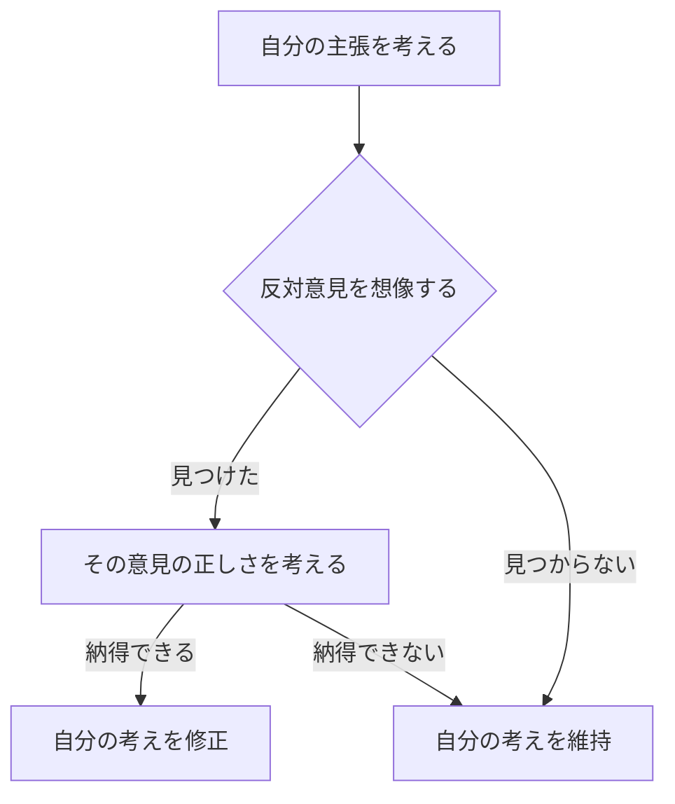

こんにちは、今日はちょっと「自分の考えを疑ってみる」ってテーマでお話ししたいんだ。

なんかいきなり怪しげ？って思うかもだけど、「反証の検討（Falsification）」って、ちょっとだけ勇気がいるけど、ものすごく大事な思考法なんだよね。

---

## 🍵「正しさ」って、ほんとに正しいの？

たとえば、「早起きは三文の得」って聞くと、なんとなく「そうだよね〜」って思わない？  
でも、その言葉を信じきっていると、夜型の人の方が集中できるって話をスルーしちゃうかもしれない。

反証の検討っていうのは、  
**「この考え方、もしかして間違ってるかも？」**って  
自分から疑ってみること。

つまり、「あえて反対側を見てみる」ってことなんだ。

---

## 🌱 反対意見、見ないふりしてない？

正直、反対意見ってちょっと嫌な気持ちになることもあるよね。  
でも、それってある意味、「自分の考えに自信があるから」ってことでもある。

でもね、たまにはこんな風に考えてみて。

> 「自分の考えに反対する人がいたら、どんなことを言ってくるかな？」

これ、けっこうおもしろいんだよ。  
想像してみると、「たしかにそこは弱いかも…」って思えることがあったりする。

---

## 📎 方法の一例：あえて逆の視点で考えてみる

### たとえば：
- 自分：フルリモートが最高！  
- 反対視点：「でも人と会わないと孤独になるよ？」

とかね。

このとき、反論を「間違ってる」とか「攻撃」として捉えないで、  
**「自分の考えの穴を見つけてくれる存在」**って思えると、ちょっと気がラクになる。



```python:python
def 反証の検討(主張):
    """
    主張に対して反証を検討する思考プロセス
    """

    # 1. 反対意見を探す
    反対意見 = 探す_反対意見(主張)

    # 2. 反対意見がなければ、そのまま主張を維持
    if 反対意見 is None:
        print("反対意見は見つからなかった。主張をそのまま維持します。")
        return 主張

    # 3. 反対意見があれば、その正しさを検討
    if 検討する(反対意見):
        # 4. 反対意見が納得できるなら主張を修正
        新しい主張 = 修正する(主張, 反対意見)
        print(f"反対意見を受け入れ、主張を修正しました: {新しい主張}")
        return 新しい主張

    else:
        # 5. 納得できなければ主張を維持
        print("反対意見には納得できませんでした。主張を維持します。")
        return 主張


def 探す_反対意見(主張):
    """
    主張の反対となる意見や証拠を探す
    例として、いくつかの反対意見候補から一つ選ぶ
    """

    反対意見候補 = {
        "早起きは三文の得": "夜型の方が集中できる時間帯がある",
        "リモートワーク最高": "孤独感やコミュニケーション不足になることもある",
        "甘いものはダメ": "適量ならストレス軽減に効果的な場合もある"
    }

    # 主張に対する反対意見を返す（なければNone）
    return 反対意見候補.get(主張, None)


def 検討する(反対意見):
    """
    反対意見の妥当性を検討
    ここでは簡単に、反対意見を受け入れるかどうかユーザーに質問する例を想定
    """

    print(f"反対意見があります: 「{反対意見}」")
    応答 = input("この反対意見をどう思いますか？（はい/いいえ）: ")

    return 応答.strip() == "はい"


def 修正する(主張, 反対意見):
    """
    反対意見を踏まえた主張の修正例
    """

    return f"{主張}（ただし、{反対意見}ことも考慮する）"


# --- 動作例 ---
if __name__ == "__main__":
    主張 = "早起きは三文の得"
    新しい主張 = 反証の検討(主張)
    print(f"最終的な主張: {新しい主張}")

```

```prolog
% 自分の主張
主張(考え).

% 反対意見を探す
反対意見(意見) :- 主張(考え), 意見は考えの反対の可能性がある。

% 反対意見が見つかったら、その正しさを検討
正しい(意見) :- 反対意見(意見), 証拠(意見が正しい).

% 主張の修正
修正(新しい考え) :- 正しい(意見), 新しい考えは意見に基づく修正。

% 主張の維持
維持(考え) :- 反対意見(意見),  \+ 正しい(意見).

% 全体の流れ
思考の流れ :-
    主張(考え),
    ( 反対意見(意見)
    -> ( 正しい(意見)
         -> 修正(新しい考え)
         ; 維持(考え)
       )
    ; 維持(考え)
    ).
```

---

## 🪞自分の考えを俯瞰するって気持ちいい

「反証」って言葉だけ聞くとちょっとこわそうだけど、  
実際には、自分の考えをぐるっと別の角度から眺めてみるだけのことなんだよね。

そうやっていくと、
- 「自分の思い込みに気づけた」
- 「本当に大事なポイントが見えてきた」
ってこともよくある。

---

## 🌼まとめ：問いかけは、自分へのやさしさ

だから、ちょっと心の中で問いかけてみよう。

> 「ほんとにそう？　別の見方はない？」

この一言が、思考に風を通してくれるから。  
自分にとって「やさしい反証」になると思うんだ。

---
