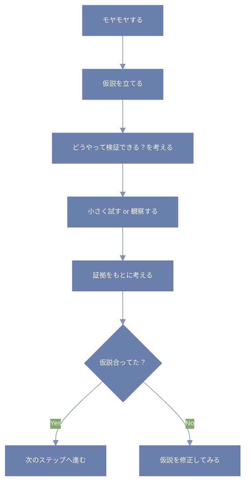

「なんかうまくいかないなぁ…」ってとき、どうしてる？

とりあえず片っ端からやってみるのも手だけど、ちょっとだけ「仮説を立ててから動いてみる」ってやり方を試してみない？

---

## 仮説ってなに？

かんたんに言えば、「こうなんじゃない？」っていう、自分なりの答えの予想のこと。

たとえば…

- ご飯がまずい → 塩を入れすぎたかも？
- 最近だるい → 睡眠時間が足りてないのかも？
- サイトのアクセスが伸びない → タイトルがイマイチだったかも？

っていうふうに、「たぶんこれが原因じゃないかな」って仮に立てた考えが仮説。

---

## 仮説のいいところ

### 🎯 話が早くなる

なんとなくで進めるより、「こうかも」って軸があるだけで、次の一手が見えやすいんだ。

仮説なしで動くと、探り探りでムダな遠回りもしがち。でも仮説があると、検証のステップに進みやすい。

---

## どうやって検証するの？

「たしかめてみる」ってことだね。  
仮説があたってるかどうか、証拠（エビデンス）を集めて判断していくよ。

- ご飯がまずい → 昨日の分量と比べてみる
- 睡眠時間 → スマホの睡眠アプリで記録してみる
- アクセス → タイトルを変えてA/Bテストしてみる

大事なのは、「なんとなく」じゃなくて、できるだけ**事実ベースで考える**こと。

### 疑似コードで見てみる
```python
# 仮説設定と検証の流れ（日本語ベースの疑似コード）

def 問題を見つける():
    # 気になること・違和感を言語化する
    return "最近、勉強しても内容が頭に残らない気がする"

def 仮説を立てる(問題):
    # 「こうかもしれない」と考えてみる
    return "スマホを見ながら勉強しているのが原因かも"

def 検証方法を考える(仮説):
    # 試す方法・観察のしかたを具体化
    return "3日間、スマホを見ないで勉強して、記憶の定着を比較してみる"

def 観察を行う(検証方法):
    # 実際にやってみて、結果を記録する
    観察ログ = [
        {"日": "1日目", "スマホ使用": "なし", "記憶の実感": "よく覚えてる"},
        {"日": "2日目", "スマホ使用": "なし", "記憶の実感": "まあまあ覚えてる"},
        {"日": "3日目", "スマホ使用": "なし", "記憶の実感": "前より良い"}
    ]
    return 観察ログ

def 結果をふりかえる(観察ログ):
    # 観察データを見て、仮説の妥当性を評価する
    if all(log["スマホ使用"] == "なし" and "覚えて" in log["記憶の実感"] for log in 観察ログ):
        return "仮説は正しそう。スマホを遠ざけた方が集中しやすい"
    else:
        return "仮説は微妙。別の要因を考える必要あり"

# 全体の実行フロー
問題 = 問題を見つける()
仮説 = 仮説を立てる(問題)
検証 = 検証方法を考える(仮説)
観察結果 = 観察を行う(検証)
結論 = 結果をふりかえる(観察結果)

print("問題:", 問題)
print("仮説:", 仮説)
print("結論:", 結論)
```

---

## よくあるひっかかり

### 💡 「仮説が浮かばない」

→ まずは「なにが変だと感じてるのか？」を素直に書き出してみよう。  
感情の中に、仮説のタネが隠れてることが多いよ。

---

### 💡 「証拠ってどう集めたらいいの？」

→ いきなり完璧なデータを求めなくてOK。  
**小さな観察**や**メモ**から始めてみよう。  
日記とかスプレッドシートとか、気軽なやつで大丈夫。

---

## フローチャートで見てみよう



## 仮説って、考える土台
仮説を立てるって、ちょっと勇気がいる。
「間違ってたら恥ずかしいな…」って思うこともあるかも。

でも、仮説はあくまで「仮」の考え。
間違ってたら直せばいいし、合ってたらラッキー。それだけ。

話し合いのときも、「仮にこう考えてるんだけど」って言い方をすれば、意見の出し方がぐっと柔らかくなるよ。

```prolog
# Prologライクな日本語論理構造（因果の形で書く）

事実:
  - 睡眠時間は平均6時間
  - 夜のスマホ使用は平均90分
  - 朝の頭の重さが3日連続で続いている

ルール:
  - スマホ使用が1時間以上の日は、翌朝の集中力が落ちる傾向がある
  - 睡眠の質はスマホ使用時間と逆相関する

仮説:
  - 「夜のスマホ時間が長くなったことで、睡眠の質が下がり、翌朝に影響している」

検証:
  - 3日間スマホ使用時間を60分以内に制限 → 翌朝の調子を記録
  - もし調子が改善すれば、仮説は支持される

結論:
  - 改善が見られた → 次の1週間で本格的に試す価値あり
  - 改善がなければ、別の要因（睡眠時間そのもの）を仮説にする
```

## さいごに
なんとなくで迷ったときは、
「自分は今、どんな仮説を持ってるんだろう？」って問いかけてみよう。

たとえちょっとズレてても、思考の足がかりができるだけで、モヤモヤの霧が晴れてくることがあるよ🌿
