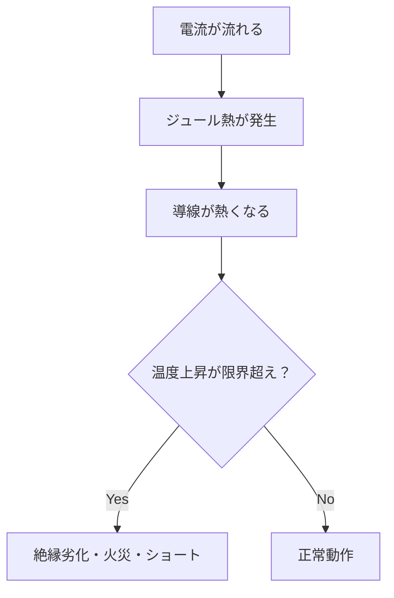

コンピュータの根幹を辿る旅：ハードウェアから電気の基礎まで

# 対象読者
技術の本質を歴史的背景からじっくり学びたいエンジニア・技術者向け

# 執筆の経緯
以前に書いた[時刻差分のアルゴリズムの記事](https://zenn.dev/zoldof/articles/8087839369b6ad)を修正する中で、極限環境に関する興味深い知見に触れました。
それをきっかけに、新たに深掘りしているアルゴリズム周辺の情報を調べるうちに、理解があいまいだった部分や、これまで見過ごしていた知識の穴に気づきました。  
そこで、基本に立ち返り「パソコンがどのように動いているのか？」から始め、最後には「電気とは何か？」まで順を追って解説し、自身の理解を深めつつ、読者の皆さんと共有したいと思います。

# パソコンの動き全体の流れ
ユーザー入力からストレージやメモリを経てCPUで処理される流れを、以下の順で分解しましょう：
出力に至るまで
処理結果がどう再びOS経由で画面に出るか

```
[ユーザー入力]
    ↓
[キーボード（ハード）]
    ↓
[OSカーネル内のデバイスドライバ]
    ↓
[入力バッファ（カーネル空間・仮想アドレス管理、MMUが関与）]
    ↓
[CPU]
    ├─ 制御ユニット（命令解読）
    ├─ レジスタ（即時データ保持）
    └─ ALU（計算）
    ↓
[メモリ階層]
    ├─ キャッシュ（SRAM）
    └─ メインメモリ（DRAM、MMUで物理アドレスに変換）
    ↓
[グラフィックパイプライン]
    ├─ GPU（命令処理、描画計算）
    ├─ VRAM（画像データ保持）
    └─ DAC + アンプ（アナログ信号時代）/ デジタル信号（HDMIなど）
    ↓
[ディスプレイ]
    └─ GUI（OSの描画システムが最終レンダリング）
```

## ソフトウェア層
- **OS（Operating System）**
ハードウェアとアプリの仲介役。リソース管理（CPU時間、メモリ、I/O）を行う。

- **カーネル**
OSの中核部分。ハードウェアを直接制御（スケジューリング、メモリ管理、デバイス制御）。

- **デバイスドライバ**
カーネルの一部（または付属）で、特定のハードウェアを動かすコード（キーボード入力、ディスプレイ出力など）。

- **GUI（Graphical User Interface）**
OSの上で動く表示・操作の仕組み（画面のウィンドウ、ボタンなど）。

## ハードウェア層
- **制御ユニット（Control Unit）**
CPU内部のブロック。命令を解読し、ALUやレジスタに「どう動くか」を指示。

- **MMU（Memory Management Unit）**
CPUに内蔵。仮想アドレス→物理アドレス変換を担当。
プログラムの同時実行のため、メモリの管理や断片化への対応として必要。

- **GPU（Graphics Processing Unit：グラフィックス処理装置）**
画面に表示する画像や映像を「高速に計算・生成」する専用プロセッサ
ポリゴンの変換、光の計算、テクスチャ貼り付けなど、複雑な3D描画を並列処理で実行する
CPUよりも「並列処理に特化」しているため、グラフィックス処理が早い
最新のゲームや動画編集、機械学習でも活躍

- **VRAM（Video RAM：映像用メモリ）**
GPUが作成した画像データを高速に保持する専用メモリ
CPUのメインメモリ（DRAM）よりも高速で、描画の遅延を減らす
大容量の画像データを一時保存
リフレッシュレートに合わせて画面にデータを送り続ける

- **デジタル信号（HDMI, DisplayPortなど）**
GPUから直接デジタル映像信号をモニタへ送る
アナログ変換不要で劣化が少なく、高解像度や高リフレッシュレートに対応
映像だけでなく音声も同時送信可能
暗号化やコピー防止機能も搭載

# CPUの仕組み
## CPU（中央処理装置）
役割：命令の実行、演算処理の中枢。
構造のポイント：
演算装置（ALU）：加算、論理演算などを行う。
制御装置（CU）：命令を解読し、演算やデータ転送を制御。
レジスタ：CPU内部の高速メモリ（数十〜数百個）。
回路的特徴：
CMOSトランジスタで構成。
クロック信号で同期して動く。
性質：
超高速、超小容量。
直接接続できるメモリはレジスタとキャッシュのみ。

基本構成はデジタル回路の集合体であり、主にCMOSトランジスタでできている。
クロック信号によってタイミングを同期しながら動作する。
パイプライン：命令の処理を段階的に並列化することで高速化。
マルチコア化：複数のCPUコアを搭載して並列処理性能を向上。

## CMOSトランジスタ

CMOSは「Complementary Metal-Oxide-Semiconductor」の略。
2種類のトランジスタ（NMOSとPMOS）を組み合わせた回路技術のこと。
電力消費が非常に少なく、高速に動作できるため、現代のCPUやメモリの回路に広く使われている。
ソースとドレインの間に電圧をかけると、そのチャネルを通じて電流が流れる。
絶縁体分子の分極による静電誘導。
高速スイッチングができるので、クロック周波数を高くできる。

エネルギー：$E=平均電圧×電荷$
自然数の和を0からに換算した結果なので
平均電圧：$V={\frac 1 2}V$
電荷：$Q=CV$
$E={\frac 1 2}CV^2$
これを周波数分繰り返すので
電力：$P=C×V^2×f$

ただし、上記の式のように電力上昇に注意しないと発熱限度を越える。
そこでマルチコアが登場。

## Pythonで仮想CPU（エミュレーター）を作る
全部をゼロから作るのは現実的じゃないので、理解に直結する「小さいコンピュータ」をシミュレーションするのがベストです。
Pythonでやるなら、「仮想CPU（エミュレーター）を作る」方法が一番簡単で、構造理解にもつながります。
電子回路をいきなりシミュレーションする必要はなく、メモリ・レジスタ・命令実行の流れをコードで再現できます。

- メモリとレジスタを用意
メモリは配列、レジスタは変数でOK。
- 命令セットを定義
例：LOAD（メモリ読み込み）、ADD（加算）、STORE（書き込み）。
- 命令デコードと実行
命令ごとに関数を作り、PC（プログラムカウンタ）で進める。
- プログラムを走らせる
メモリに命令を並べ、CPUループで実行。

```python
# メモリ（命令とデータ）
memory = [
    ("LOAD", 0),   # R0 ← memory[0]
    ("ADD",  1),   # R0 ← R0 + memory[1]
    ("STORE", 2),  # memory[2] ← R0
    ("HALT",)      # 停止
]

# データ領域
data = [5, 3, 0]  # memory[0]=5, memory[1]=3, memory[2]=0

# レジスタ
R0 = 0
PC = 0  # プログラムカウンタ

while True:
    instr = memory[PC]
    opcode = instr[0]

    if opcode == "LOAD":
        R0 = data[instr[1]]
    elif opcode == "ADD":
        R0 += data[instr[1]]
    elif opcode == "STORE":
        data[instr[1]] = R0
    elif opcode == "HALT":
        break

    PC += 1

print("計算結果:", data)
```

```
計算結果: [5, 3, 8]
```

- memory：命令の並び
- data：データメモリ
- R0：レジスタ
- PC：命令を順番に読むためのカウンタ
- 実装したのは、フェッチ → デコード → 実行 → PC更新の流れ

# RAMの仕組み：情報の受け取りから処理までの流れ 
執筆の出発点として、RAMがパソコンの情報をどのように扱うか、基本的な役割を理解することから始めました。  
この記事内でRAMの具体的な動作までは踏み込みませんが、全体の情報処理の流れを把握するための重要なステップと捉えています。  
- CPUはどのような動作でRAMに指示するか？
- RAM：CPUから直接データにアクセスできるメモリ
  - SRAM（キャッシュ）：トランジスタを用いたフリップフロップ回路で構成される。例えるなら、**SRAMは「近くの机の引き出し」** で即座に必要なものを取り出せるが、収納は少なめ       
  - DRAM：トランジスタとキャパシタ（コンデンサ）で構成される。例えるなら、**DRAMは「大きな倉庫」** で安く大量に物を置けるけど、出し入れは少し時間がかかる。
DRAMが遅いのは、充電・放電・リストアを伴う構造と、アクセスの多段階化によるレイテンシが原因。
メモリが大容量であるために、CPUとの速度ギャップが拡大し、局所性を利用するキャッシュが必須になった。

## SRAM（Static RAM）
- 役割：キャッシュメモリ（L1〜L3）として使われる。
- 構造のポイント：1ビットを保持するために**6個のトランジスタ（6Tセル）**を使用。
フリップフロップ回路で電流を流し続け、状態を保持。
- 回路的特徴：リフレッシュ不要（DRAMと違ってコンデンサを使わない）。
- 性質：高速（CPUクロックに近い）、低レイテンシ。
ただし面積が大きく、大容量にできない。
消費電力はDRAMより高め。

## DRAM（Dynamic RAM）
- 役割：メインメモリとして使用。
- 構造のポイント：1ビットを**1トランジスタ＋1コンデンサ（1T+Cap）**で構成。
電荷でデータを保持するので、数msごとにリフレッシュが必要。
- 回路的特徴：単純な構造で高集積化が可能 → 大容量化に向く。
- 性質：大容量、低コスト。
速度はSRAMより大幅に遅い（キャッシュが必要な理由）。
消費電力は低いが、リフレッシュに追加電力がかかる。

## なぜDRAMをつかうのか？
電気代節約のために、熱暴走を防ぐために、一時的に電流を遮断している。
そうであればSRAMのように全部が繋がっている必要はない。
かさばりそうだけど、6Tにのフリップフロップよりも1T1Cを別個に配線するのは、多少の場所はとったとしても許容範囲。そもそも6倍のビットが扱えるし、消費電力も少なくてすむ。だからこそ熱耐久以内の製品がつくれる。

## SRAMとDRAMの根本的な違い
それは半導体と絶縁体の性質が決定づけた構造設計の結果。
SRAMは“半導体のみで保持する方式”、DRAMは“絶縁体を活かした電荷保持方式”。
SRAMやレジスタは1ビットあたりの回路が複雑＆面積が大きく、しかも高速動作用の精密製造が必要だから高コスト。DRAMは構造が単純で大容量製造に適しているから安価。

## セル（Memory Cell）
メモリの最小単位（SRAMなら6T、DRAMなら1T1C）。

## バッファ(buffer)：緩衝器や緩衝材のこと
バッファはDRAMの中にあり、入力に対するメモリとして存在するFIFO形式のメモリ。CPUの処理に使うキャッシュやレジスタに入力バッファを置いたら、全体パフォーマンスが下がる。
ハードウェア的には、デバイス側にFIFOバッファを持っている場合もある（例：キーボードコントローラの内部RAM）

## オーバーヘッド
本来の処理以外にかかる追加コスト（例：コンテキストスイッチ、仮想メモリ変換、キャッシュミス処理など）。                               

# 命令の流れを追う：CPUが指示を実行する仕組み
コンピュータに命令を与えると、CPUはその指示をどのように理解し、実行しているのでしょうか？  
この章では、CPUが命令を受け取り、処理し、次の指示へと流れる一連の仕組みを順を追って解説します。  
まずは、命令の流れを把握することで、CPU内部の働きの全体像をつかみましょう。

## ユーザー入力受付
周辺機器（キーボードやマウスなど）は、物理的な信号（ボタン押下など）を電子信号（ビット情報）に変換する回路が内蔵されている。

これらの信号はバス回路やI/Oポートを通ってCPUに届くよう、マザーボードの設計段階で配線と制御回路が組み込まれている。

## 命令の受取手順とCPU大別
- 命令はバイナリ列（opcode + オペランド）で表現
- opcode部分のビット数が、命令の種類を決める上限
- x86：8086 は、Intelが1978年に発売した16ビットCPUの名前。32ビットCPUの80386は1985年に導入
- x64：x86-64と呼ばれるCPUで2003年に拡張導入、AMDという会社が先に拡張開発に成功［AMD64］、Intelが追随

最新のCPUが実行する「命令」は、複雑な動作を1つで実現するものが多い。
例えば、データを読み込んで演算して、結果を保存する動作をひとまとめにできる命令もある。
こうした命令は、必要な情報（操作の種類、対象、メモリ位置など）を細かく指定するため、追加のデータが必要になる。
そのため、単純な指示（1～2バイト）では足りず、平均3～6バイト程度になる。
とはいえ、命令数が膨大になるわけではなく、せいぜい数千種類で残りはアドレスや即値、サイズ情報に使われる。

# マイクロコードから電気信号へ：言語処理の詳細な階層構造
- CPU = 工場
- 制御ユニット：司令塔（どの機械を動かすか決める）
- ALU ：作業機械（演算する）
Arithmetic Logic Unit（算術・論理演算装置）
- レジスタ：作業机（材料を一時置きする場所）

命令バイナリ → デコーダ（論理回路）→ 制御信号セット → ALUやレジスタが動作

**ALUの処理の流れ**
[入力A] ─┐
          ├─[算術ユニット（加減）]
[入力B] ─┘
          ├─[論理ユニット（AND, OR...）]
          ├─[シフトユニット（SHL, SHR...）]
              ↓
          [出力] → レジスタなどに渡す

## 局所性の原理
「プログラムは“同じものを何度も使う”し、“まとめて近いものを使う”」

- if文やループでは同じ変数を繰り返し参照 → 時間的局所性
- 配列処理は連続したアドレスを参照 → 空間的局所性

そのため処理の順番は処理の近い順で以下のようになる
1. レジスタ：演算に使うデータ
2. SRAM：最近使うデータ
3. DRAM：作業領域全体
4. SSD/HDD：長期保存

## プログラミング処理から制御信号の発信まで
**用語整理**
- コンパイル(Compile)：コードを「集めて一つにする」 → 高級言語から低級言語に翻訳すること
- アセンブル(Assemble)：命令部品を「組み立てる」 →アセンブリ言語をCPUが処理できる機械語に翻訳すること
- フェッチ (Fetch)：英語で「取りに行く」という意味。CPUが「命令をメモリから取り出す」工程
- デコード (Decode)：「コードを解読する」という意味。命令ビット列（0と1の並び）を解析して、どの操作をするのか・どのレジスタを使うのかを理解する工程
- 高級言語：CPUやレジスタのことを意識しない
- 低級言語（アセンブリ言語）：CPU命令セットに直結
- 機械語：CPU専用の0/1パターン
- ROM：データ処理用ではなく、CPUやシステムの動作ルールを保持
- ISA（Instruction Set Architecture）＝命令セットアーキテクチャ：ソフトウェアがCPUに命令を出すための「約束事」。アセンブリ言語のこと
- アーキテクチャ(Architecture)：原義は「建築の設計、構造」のことで、全体の構造を「設計」する → CPUの設計思想
- マイクロコード：CPUからすれば論理回路を動かすための手順書であり、それはバイナリ表現で書かれている

**フローチャート**
[プログラミング言語の高レベル命令（C, Pythonなど）]
          ↓ (コンパイル)
[アセンブリ言語]    ADD R1, R2
          ↓ (アセンブル)
[機械語: 0と1の命令]  000000010010...
          ↓ (フェッチ)
[命令をメモリから読み込む]
          ↓ (デコード)
[命令の意味を解釈し、制御信号に変換]
          ↓ (制御信号生成)
[ALUにADD指示 / レジスタ選択 / メモリアクセス指示]
          ↓ (CPUが実行)
[ALUがR1+R2を計算してレジスタに格納]
          ↓ (必要ならマイクロコード参照)
[複雑命令なら、マイクロ命令で細分化して処理]
          ↓
[マイクロコード ROM] ←「ステップ1: R1の値をALUに送る」
                      「ステップ2: R2の値をALUに送る」
                      「ステップ3: ALUで加算」
                      「ステップ4: 結果をR1に書き戻す」
                      ...
          ↓
[新たな制御信号を出して実行]

マイクロコードの「ステップ1: R1の値をALUに送る」であれば、たとえば8ビットの論理演算だとして、8つのビットそれぞれに対応する信号をおくる。
数字を2進数にしないといけないから、それは別の高レベル命令およびマイクロコードで処理している。
高度な連携プレイ。
論理演算の結果自体はCPUのバスで並列回路切替によるコピーで対応している。
SRAMへ渡す必要があるので、別途で渡す用の命令が仕込まれている。

# クロックと水晶ウェハ：正確なタイミングを生む仕組み
CPUは複数の命令を同時に処理するために「流れ作業」にする。
そこでパイプラインという概念が重要となる。
パイプラインとは英語で「配管」や「流れ作業」。
以下のような手順である。

1. クロック1: 命令1をフェッチ
2. クロック2: 命令1デコード + 命令2フェッチ
3. クロック3: 命令1実行 + 命令2デコード + 命令3フェッチ

## クロック：CPUの心臓の鼓動（一定のタイミングの電気信号）
1クロックごとに回路が動く。クロック周波数（例：3GHz）＝1秒間に30億回の「動作タイミング」。各工程（フェッチ・デコード・実行）はこのクロックで同期して進む。発振回路とPLLで構成されている。

**クロックロスの実態**
**ジッタ（クロックの揺らぎ）**でタイミングがずれる
クロック分配の遅延で信号が均一に届かない
トランジスタのスイッチング遅延が一定以上になることも
パイプラインのハザードやメモリ待ち時間によるストール
消費電力・発熱のためにクロック上げられない場合

**発振回路（Oscillator）**
クロックの「元となる周期信号」を作る部品。代表例：水晶発振子（Quartz Crystal Oscillator）。水晶は圧電効果で電圧を加えると一定周期で振動する。周波数は水晶の形状で決まり、安定性が高い。PCマザーボードにある「クロックジェネレータ」がこれを利用。CPUがクロックツリーでこれと受け取る。

**PLL（Phase-Locked Loop）**
クロックの周波数を上げる仕組み。水晶発振子はせいぜい数十MHzしか出せない。PLLで逓倍（周波数を整数倍に増やす）。例：外部クロック 100MHz → PLLで ×30 → 3GHz

## 水晶ウェハの作り方
1. 材料準備
高純度のSiO₂を人工的に成長させる
天然水晶より人工水晶の方が不純物が少なく、周波数安定性が高い
2. ウェハ切断
必要な周波数に合わせて水晶を特定の角度にカット
角度で温度特性が変わる
3. 薄片加工
数十～数百ミクロンの厚さにスライス
研磨して所定の寸法に調整（厚み＝共振周波数）
4. 電極形成
水晶の両面に金属膜を蒸着して電極を作る
5. 封止
真空または不活性ガス中でパッケージ封入
温度や湿度の影響を減らすため

# 重要単語の語源と意味：基礎知識の整理
| 略語       | フルネーム                        | 語源・由来のポイント                                                                                                              |
| -------- | ---------------------------- | ----------------------------------------------------------------------------------------------------------------------- |
| **CPU**  | Central Processing Unit      | - **Central**：中心となる、中央の<br>- **Processing**：処理、演算<br>- **Unit**：単位、装置<br>→「中央の処理装置」で、コンピュータの中核として命令を処理する部分。             |
| **SRAM** | Static Random Access Memory  | - **Static**：静的な（リフレッシュ不要で状態を保持する）<br>- **Random Access**：任意アクセス可能なメモリ方式<br>- **Memory**：記憶装置<br>→リフレッシュ不要のランダムアクセスメモリ。 |
| **DRAM** | Dynamic Random Access Memory | - **Dynamic**：動的な（定期的なリフレッシュが必要）<br>- **Random Access**：任意アクセス可能<br>- **Memory**：記憶装置<br>→動的にリフレッシュしながら使うランダムアクセスメモリ。   |
| **ROM**  | Read-Only Memory             | - **Read-Only**：読み出し専用の<br>- **Memory**：記憶装置<br>→書き換えは基本的にできず、読み出しだけに使うメモリ。                                             |
| **ドライブ**| Drive  | 「動かす・駆動する」という意味の英単語 "drive"。<br>元々は「馬や車を走らせる」「動かす」動詞から派生。装置を動かしてデータの読み書きをする機械 |        
| **SSD**  | Solid State Drive            | - **Solid State**：半導体素子のような「固体状態」の意味（可動部品なし）<br>- →可動部品なしの半導体ドライブ。                                |
| **HDD**  | Hard Disk Drive              | - **Hard Disk**：磁気ディスクの意味（固いディスク）<br>- →磁気を使う物理的なディスクドライブ。                                         |
| **レジスタ** | Register                     | - 英語の「register」は「登録する」「記録する」が語源<br>- 計算機の文脈では、情報を一時的に記録・保持する小さな記憶装置という意味。                                               |

# 論理回路とビット：情報処理の基本単位
## 構造
論理回路はトランジスタと抵抗で構成されていて、何個論理回路を使っているか、その単位がビット。ビットは電子機器の最小情報単位となっている。ビットは10進数の数を2進数(Binary)で表現し「バイナリ表現」とも呼ばれる。コンピュータ内部は電気信号の「オン（1）・オフ（0）」で動くため、バイナリ表現が基本。ここで言う電気信号に見立てられるのがビット。例えば色の表現は16777216色で、これは256の3乗。256は8ビットで表現できる数で、3原色のサブピクセルなので3乗する。8ビットとは1ビットが8個直列に繋がれている状態。スマホやタブレットにおいてバックライトのカラーフィルター透過率を調整することで色の違いを表現する。

## 論理演算：論理回答の演算の仕組み
- 論理演算
  - 論理積(AND)：直列回路
  - 否定論理積(NAND:not and)：論理積と対象を並列につなぐ
  - 論理和(OR)：並列回路
  - 否定論理和(NOR:not or)：論理和と対象を並列につなぐ
  - 否定論理(NOT)：対称と並列につなぐ
  ＊論理積と論理和以外は直前に抵抗をつなぐことでバイパスを防止
  - 排他的論理和(XOR:exclusive or)：論理和の入力に論理積をつけ、その論理積の各片方の入力に否定論理をつける
- 加減乗除
  - 加算：半加算器（XOR + AND）→ 全加算器（桁上がり処理）→ Nビット加算器
    - 和 = (A XOR B) XOR Cin
    - 桁上がり = (A AND B) OR (Cin AND (A XOR B))
    ＊Cinは前の桁の桁上がりCoutを受けとるという意味
  - 減算：2の補数を使って加算で実現
    - 8ビットなら2^8で割った余りが使いたい負の数であり、それを表現するためにビット反転＋1を使っている。なぜなら8ビットを255までの時計とするなら0から負の数の絶対値分だけ遡ることになるから。2の補数とは反転＋1したもののことを言っている。0の補数は0となる。
  - 乗除：ビットシフト

# MOSFETと抵抗の基礎：半導体の働きと電気の流れ
## 抵抗とは？
- 抵抗の役割：電流を制御する・電圧を分ける・エネルギーを熱に変換
- ショート（短絡）：抵抗がほぼゼロの経路に電流が流れ込む状態のこと
- ショートを防ぐために回路全体の電流量を制限する抵抗をつなぐ

## 抵抗の基本構造は3パターン
- カーボン皮膜抵抗（古典的）：炭素の棒
- 金属皮膜抵抗（一般的）：金属薄膜をコーティング＋らせんカット
- 巻線抵抗（高電力）：金属線をコイル状に巻く

## 抵抗値の決まり方：
$𝑅=𝜌×𝐿/𝐴$
（材料の抵抗率 × 長さ ÷ 断面積）

## 抵抗器とMOSFETの違い
抵抗器は物質の抵抗率＋形状で電流を制御し、金属キャップに接続するパッシブ素子（常に同じRで電流を妨げる）
MOSFETは電界でチャネルを生成してON/OFFする。
金属電極につなぐアクティブ素子（電圧で状態を変え、電流を制御する）
→ MOSFETのオン抵抗は変化可能（ゲート電圧で変わる）

MOSFETは金属-酸化膜-半導体電界効果トランジスタの略です。

構造と役割は以下：
- S（Source）：電流の入口
- D（Drain）：電流の出口
- G（Gate）：電界でスイッチを制御
- チャネル：ソースとドレインの間に電流が流れる道（ゲート電圧で生成）
- 酸化膜（SiO₂）：ゲートと半導体の間の絶縁層（だから電流が流れない → 入力インピーダンスが高い）
＊遮断体とは区別される
- **出力インピーダンス** とは出力から見た流れにくさで「蛇口の細さ」のようなもの
- **入力インピーダンス** とは入力から見た受け入れにくさ「 ホースの入口の広さ」のようなもの

:::message
MOSFETはBJTと比較して消費電力が低い。
ON/OFFだけでエネルギーを使う → 高速で低消費電力
→ だからRAMや論理回路ではMOSFETが主流。
:::

| 用語                | やさしい説明                                                  | 具体例・役割                              |
| ----------------- | ------------------------------------------------------- | ----------------------------------- |
| **N+ / P+ 高濃度領域** | 半導体の中で電子（N型）や正孔（P型）がたくさんいる部分。普通の半導体より「どっさり」キャリアがいるイメージ。 | 電流の流れやすい通り道。トランジスタのソース・ドレインなどで使われる。 |
| **金属電極**          | 電気をよく通す金属でできた端子。回路と半導体をつなぐ橋渡し。                          | 銅やアルミでできていて、配線や外部接続に使う。             |
| **ポリシリコン**        | シリコンを小さな結晶が集まった多結晶状態にしたもの。半導体として使う金属に似た素材。              | MOSFETのゲート電極に使われ、電圧をかけやすい。          |
| **酸化膜**           | シリコンの表面に作る薄い絶縁膜（酸素とくっついたシリコン）                           | ゲートとチャネルを絶縁し、電気が直接流れないようにする。        |

# 電場とキャパシタ：成り立ちと歴史的背景
## コンデンサ(capacitas)とは？
2枚の導体と間の絶縁体で電場を保つ。
電場とは蚊取り線香で言えば匂いのようなもので、空間にじんわり広がるもの。
電界とも呼ばれる。
抽象的に言えば、電気が他の電気に影響を与える範囲。

定義は
$$E=F/q$$「その場に1クーロンの電荷を置いたら、どれくらいの力を受けるか？」で変形すると
$$F=qE$$なので仕事量の式にすれば
$$W=qEd$$これを電荷あたりでみたものが
$$V=W/q=Ed$$そしてコンデンサで使われる静電容量
$$C=q/V$$で「電圧に対する電荷のたまり具合」。
電場は電荷面密度からも求められ
$$E=𝜎/ε$$電荷面密度は
$$q/A$$よって
$$E=q/εA$$もとの電場の式と静電容量の式から
$$C=ε×A/d$$

## ポイント
- 電荷が増えると電場が強くなる
- 電場は電位差（電圧）を生み、距離が大きいと電圧も大きくなる
- 面積が大きいほど、同じ電荷でも電場が弱まる → 電圧が下がり、容量が増える

誘電率$ε$とは、正しくは**比誘電率（相対誘電率）**と呼ばれ、$ε=ε_r×ε_0$となる。
$ε_0$とは真空の誘電率のことで、マクスウェルの方程式を整合させるために定められた「電場の空間的な単位の基本定数」。$ε_r$とは物質固有の無次元数。
真空の誘電率を基準にすることで、物質の特徴を相対的に表現でき「水は真空の80倍電場に影響を与える」といった具合。
アンペール-マクスウェルの法則は電磁波（光やラジオ波）が空間を進む仕組みのベースで、電流が流れると磁場ができ、時間的に変わる電場も磁場を生むことを表す。
透磁率 $μ_0$は実験で求めたもの。
マクスウェルの法則に関連する電磁誘導のファラデーの法則にはレンツの法則が作用しており、エネルギー保存則が元になっている。
仕事、力学、電磁気、総合をすべて一般化したのがノーターのラグランジアン。
電場の流れは電子とは逆で定義され、右ねじの法則でいうと人差し指の方向に速度ベクトル、中指が磁場、親指がローレンツ力（負の電荷の場合はベクトル平面を境に逆になる）。
電子回路の＋極から－極に向かう電流は「正電荷が流れている」と考えられているが、実際は電子が－極から＋極に移動している。

# 真空管とNPNトランジスタ：発展の歴史と技術的特徴
## トランジスタ(transfer+resister)とは？
半導体で真空管の機能を小サイズ実現したもので、半導体は電気を通す「導体」と、通さない「絶縁体」の中間の性質を持つ物質。真空管は無線通信を遠くまで飛ばす増幅器として発明されたが、装置が大きいためサイズの制限があった。
＊n(negative)は負の電荷、p(positive)は正の電荷

## ベース電圧と電流：熱とショートのメカニズムを歴史から理解
| 観点    | 真空管（三極管）                  | NPNトランジスタ（バイポーラ）          |
| ----- | ------------------------- | ------------------------- |
| 構造    | 真空中に3つの電極（カソード・グリッド・プレート） | 半導体中に3つの領域（エミッタ・ベース・コレクタ） |
| 動作原理  | 熱で飛ばした電子をグリッドで制御する        | 半導体内部の**電子の注入と吸収**で制御     |
| 電子の流れ | カソード → プレート               | エミッタ → コレクタ               |
| 制御信号  | グリッドの電圧                   | ベース電流                     |
| 電力効率  | 電力が大きく、発熱も多い              | 省電力で小型化可能                 |
| 利点    | 高電圧・高出力に強い                | 小型・低コスト・大量生産向き            |

  コレクタ（n型）←出る場所（電流の出口）
       ↑  
    ベース（p型）←細く狭く絞られた流路（電流制御点）
       ↑  
  エミッタ（n型）←入る場所（電子の供給源）

トランジスタはベース電圧で電流のオン・オフや量を制御する。電流が流れることで回路上に電力（電圧×電流）が生じ、これが熱やモーターの回転などの仕事として現れる。導線自体にも抵抗があるため、電流が流れるとジュール熱が発生し、温度が上がると抵抗値が変化することもある。このようなフィードバックにより、実際の電流値や出力は、単なる理論値よりも複雑に変化することがある。ショートは上記の熱が原因である。

**さらに詳しく深掘りした説明**
電流による熱量は#Q=I^2×Rt#で電流の2乗に比例する。
まず、導線は電流によって発熱するのは上記のような理由から。
熱量の式は電力から導ける仕事量の式の電圧を電流で表現したもの。
実験や観測で導かれた式は、電圧の定義、熱量の定義、ニュートンの運動法則、電圧はカエルの脚の筋肉が電気で動く→電池の発明→電荷が動くと熱（熱量とは別にその差を測定して電圧という単位に落とし込んだ）が発生するという発見から。
熱量は羽根車の回転と水の温度上昇の関係から、運動法則はガリレオの落体実験をニュートンが体系化した。
運動法則により質量と重さの違いが明確定義化。
重さは質量に加速度を乗算したもの。
最古で重さを測るための天秤はシーソーのようなテコの原理から発展して発明された。
その単位はおもりそのものであった。

| 電線の太さ（断面積）  | 許容電流の目安 |
| ----------- | ------- |
| 0.75 mm²（細） | 約7A     |
| 1.25 mm²（中） | 約15A    |
| 2.0 mm²（太）  | 約20A    |



# 直流・交流と電気の定義：歴史的背景からの基礎理解
## 直流とは？
- 電池：化学反応で常に一定方向の電流を供給
- 整流回路：交流をダイオードで一方向にして直流化
## 交流とは？
- 発電機でコイルと磁石を回す → 電磁誘導で電圧が周期的に変わる。コイルの回転が「波」を作るので、自然と正弦波になる。クロック信号の場合は矩形波
家庭用コンセントは 交流（AC） → 電位差が 周期的にプラス・マイナス反転
日本：50Hz or 60Hz → 1秒間に50回または60回、極性が入れ替わる
平均値は0だけど、瞬間的な電位差は±100V
つまり、「電圧ゼロになったり反転したり」しているけど、常に変化しているのでエネルギーを供給できる
## 電気とは？
- 電流・電圧・電場・静電気・電磁波などを含む「電荷に関する現象全体」のこと
## 電流とは何か？
電流とは、電気の流れであり、静電気の発見から始まり、電流が通りやすい物体「導体」を認識するところから進展した。
導体の電流が方位磁針を動かしていることに気づき、磁石との関連性が明らかになった。
その後、逆に磁石によって電流が発生することが分かり、強磁性体から強化・複製された永久磁石を量産することで発電の仕組みが確立され、結果的に文明で扱える電流が増産されてきた。
磁石は紀元前の古代ギリシャや中国で発見され、タレスは琥珀と明確に区別していたが、中世以降、発電の発見により磁石と電流の関連性が明らかになった。
また、静電気とは別に摩擦によって熱が発生し火を生み出したことも文明の重要な発見であり、その違いは摩擦の方法や対象物の違いによるものであった。
方位磁針はもともと後漢時代の占いに使われていたが、やがて航海に応用され世界中に広まった。
## 電流、電圧、電力、エネルギーの違い
- 電流は単位時間あたりのクーロン力、電圧は単位クーロンあたりの電荷の移動エネルギー、電力はそれらを乗算することで分かる単位時間あたり電荷移動エネルギー、エネルギーは電力をある一定の時間つかうことで移動エネルギーがどれぐらいになるかを示したもの
- クーロン：電荷の単位
## 粒子や電荷とは何か？
電荷は18世紀に発見、粒子は物質の最小単位で19世紀に発見された。
負の電荷を持った粒子である電子が定義された。
電子1つの電荷は実験で定義され、原子核構造を調べる中で陽子や中性子も発見された。
ほとんどの物体は電気的に中性で、イオンは電荷を持つ原子や分子で、これが溶液の酸性・アルカリ性や電気的性質を変える。
分子は原子の集まりで、原子は粒子の集まりで、粒子は電子、陽子、中性子で構成され、電子は原子核の周りを周回し、原子核の中身は陽子と中性子。歴史的経緯で正負逆。
