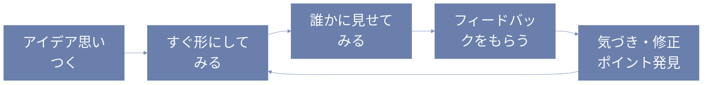
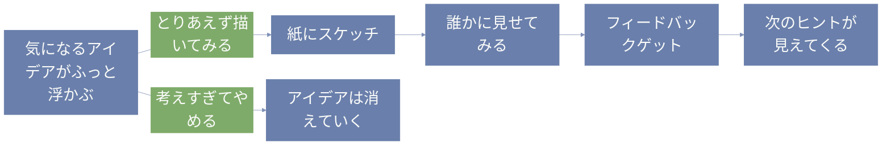

みんな、こんにちは。  
今日はデザイン思考のステップのひとつ、「プロトタイプ」について、ふんわりお話ししていくよ。

---

# プロトタイプってなに？

プロトタイプっていうと、なんだかすごく専門的なものに感じちゃうかもしれないけど、実はもっとラフで気軽なものなんだ。

ざっくり言うと、「アイデアをカタチにして、試してみること」。  
まだ完成していなくてもいい。むしろ「未完成でOK」ってところがポイント。

---

# たとえばどんなカタチ？

アイデアをすぐ試すっていっても、いろんなやり方があるよ。

- **紙に描いたスケッチ**  
  ちょっとしたアプリのイメージや、サービスの流れを手描きで。

- **段ボールや折り紙で作った模型**  
  空間や構造を想像したいときに便利。

- **紙芝居風のストーリー展開**  
  使う人の気持ちを追体験するために。

- **スライドや画像を使ったプレゼンっぽい説明**  
  頭の中にある構想を、人に伝える手段として。

大事なのは「ちゃんとしてるか」じゃなくて、「伝わるか・試せるか」なんだよね。

---

# どうしてそんなに急ぐの？

デザイン思考では「とにかく早く試して、早くフィードバックをもらう」っていうのがすごく大事。  
なぜかというと…

- 自分の考えてたことと、実際に使った人の印象ってけっこう違う  
- 完成してから直そうとすると、時間もコストもめちゃかかる  
- 早いうちに小さく失敗すれば、あとで大きな修正をしなくてすむ  

だからこそ、まずは試作。  
完璧を目指す前に、ラフでもいいから“形にする”。  
そこから学んでいくのがプロトタイピングなんだ。

---

# ◆ 図でプロトタイプを理解しよう

## フローチャート


## 疑似言語
```
【プロトタイプづくりの擬似言語】

もし アイデア が浮かんだら:
    スケッチ用紙 を 用意する
    アイデア を描いてみる

    もし ストーリー があるなら:
        コマ に 分けて 並べる

    ひとりで 読み返してみる

    もし 誰か に 見せられそうなら:
        スケッチ を 見せる
        反応 を 観察する
        気づいたこと を メモする

    気になった部分 が あれば:
        修正 を 試してみる
```

## prolog
```prolog
% 状況: アイデアはあるけど、なんとなく詰まっている
% 選択肢: 思考だけで悩み続けるか、手を動かしてみるか

詰まった :- 考えすぎ, 進まない.
突破口 :- 手を動かす, 可視化する, 気づく.

% 例:
% ?- 詰まった.
% → true

% ?- 手を動かす.
% → なんかモヤっとしてたとこが見えてきた！
```

---

# 「まだ早いかも…」と思ったときこそやってみて

よくあるのが、「もう少し考えが固まってから作ろう」って待っちゃうパターン。  
でも実は、「なんとなく思いついた」くらいのタイミングで作ってみるのがちょうどよかったりする。

実際に手を動かしてみると、思ってたよりうまく伝わらなかったり、逆に意外な発見があったりする。  
頭の中だけで考えてると見えないものが、形にした途端に浮かび上がってくるんだよ。

---

# フィードバックは「正解」じゃなく「ヒント」

人に見せるときって、ちょっとドキドキするよね。  
「変って言われたらどうしよう」とか、「やっぱまだ見せたくないな」って思うかもしれない。

でも、プロトタイプを見てもらうのって、「評価されるため」じゃなくて「ヒントをもらうため」。  
誰かのリアクションを通して、自分でも気づいてなかった“違和感”に気づけたりする。

ときには「それ、ちょっとややこしくない？」って言われて、ハッとすることも。  
そういうのも全部、次のステップにつながる材料になるからね。

---

# プロトタイプを“遊び”にしちゃおう

もし「プロトタイプって難しそう…」って感じてたら、ちょっと視点を変えてみて。

たとえば、子どものころやった工作みたいに、  
「こうしたらどうかな？」ってワクワクしながら作ってみる。  
誰かに見せて、「え、なにそれ〜」って笑われたら、それはそれでうれしい。

プロトタイプって、そんな“遊び心”が大事。  
うまくいくことより、「試してみること自体」が価値なんだと思ってみてね。



---

# まとめ：ゆるっと、でも前に進む

プロトタイプは、完成を目指すものじゃない。  
「試すために作る」ものなんだ。

ゆるくていい、ざっくりでいい。  
少しでも形にしてみたら、それだけで次に進める。  
手を動かした分だけ、見えてくる世界があるよ。

だからまずは、紙とペンでも、スマホのメモでもOK。  
ちょっとだけでも「カタチ」にしてみよう。  
きっと新しい気づきが、ふわっと生まれるからね。
