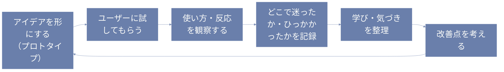

デザイン思考って、なんとなくアイデアを出すとか、共感するとか、そんなイメージがあるかもしれないけど──  
じつは最後のステップ「テスト」が、いちばん宝物が眠ってる場所だったりするんだ。

---

# テストって、どんなことするの？

ここで言う「テスト」は、学校のテストみたいに正解を出すことじゃなくて、  
**「作ったものを実際の人に見てもらって、どう感じるか、どこが使いにくいかを聞いてみる」** ってこと。

**フローチャート**  


たとえばこんな感じ。

- 作ったプロトタイプを友だちに試してもらう
- 5分で答えてもらえる簡単なアンケートを作ってみる
- 実際のシーンで使ってもらって、反応を観察する

ちょっとした「うーん…」という表情や、「こういうの苦手なんだよね」っていうつぶやき。  
そういうリアルな声が、何よりのヒントになるよ。

---

# 失敗、大歓迎

大事なのは、「うまくいくか」よりも「どんな反応が返ってくるか」。

正直、うまくいかないことのほうが多いよね。  
でもそれって、**すごく大きなヒント**なんだ。

たとえば、
> 「このボタン、どこ押せばいいかわからなかった」

って言われたら、「もっと目立つデザインにしよう」って改善できる。  
つまり、**失敗って、次の一手を教えてくれる先生**でもある。

それに、誰かに試してもらうことで、「自分の思い込み」に気づくことも多い。  
「え、そこ引っかかるんだ…！」って発見があるから、テストはほんとに学びが深いんだよね。

---

# テストって、怖くない？

たしかに、勇気いるよね。  
「ダメ出しされそう」「恥ずかしいな」って思っちゃうこともある。

でもね、**ここで感じた違和感や意見が、アイデアを本物に育ててくれる**んだ。

思い出してみて。  
誰かのちょっとした一言で、考えがガラッと変わった経験、ないかな？

テストって、まさにそんな瞬間を自分から取りにいく時間。

それに、試してみたあとに「ありがとう、助かったよ」って言われると、すごくうれしい。  
**一方通行じゃないものづくり**って、あったかいよね。

---

# 小さくはじめてみよう

本格的なユーザーテストじゃなくてもいいんだ。

- 紙に描いたアイデアを誰かに見せて、「どう思う？」って聞いてみる
- 家族にちょこっと説明して、反応をメモしておく
- SNSで「どっちが使いやすそう？」って軽く質問してみる

**擬似言語**  
```pseudo
# ユーザーテストログ（予約画面）
System := 「この画面、ちょっと試してみてほしいな」
User := 「いいよー。えっと…予約はどこから？」
Observe := ユーザー、予約ボタンを即座に認識できていない

System := 「あ、下の“開始”ってボタン、そこ！」
User := 「これ？ “開始”って、なんかもう始まりそうな感じするなぁ…」
Observe := ラベルと目的のズレ → “開始”では意図が伝わらない？

System := 「あ〜なるほど。“予約する”って書いたほうが安心？」
User := 「うん、その方がわかりやすいと思う！」
System := 「ありがとう、めっちゃ参考になる！」

# 学び：
# ・ボタンの文言は行動を正しく誘導する必要がある
# ・“予約”と“開始”では期待する体験に差がある
```

**prolog**
```prolog
% ユーザーは「予約ボタン」を探していた
発話(ユーザー, '予約ってどこからするんだろう？').

% 「開始」というラベルは、ユーザーにとってわかりづらかった
ボタンラベル('開始').
感じ(ユーザー, 'なんか始まっちゃいそう').

% ラベルを「予約する」にすればわかりやすいという提案があった
提案(ユーザー, '「予約する」って書いてあったら、すぐ分かったかも').

% 学びとしてのルール化
わかりにくいラベル(Label) :-
    ボタンラベル(Label),
    感じ(ユーザー, '意味が違うと感じた').

改善候補('「予約する」') :-
    わかりにくいラベル('開始').

% 質問形式の推論も可能
?- 改善候補(ラベル).
```

**小さく試して、小さく直して、また試す。**  
この繰り返しが、だんだん「本当に使ってもらえるもの」を育てていく。

試しに、今日つくったものを一人に見せてみる。  
それだけでも、すごく価値のある一歩になるよ。

---

# おわりに：テストは"愛の行為"かもしれない

「この人にとって、もっといい形があるかも」って思って、  
ちょっと試して、ちょっと直してみる。

それって、なんだか**その人のことを大事に思う気持ち**にも似てる。

だからテストって、技術じゃなくて**やさしさの延長**なのかもしれないな、って思うんだ。

次にアイデアを思いついたら、ちょっと誰かに見せてみよう。  
「うまくいかない」って思ったときこそ、宝物が見つかるチャンスかもよ 🌱
