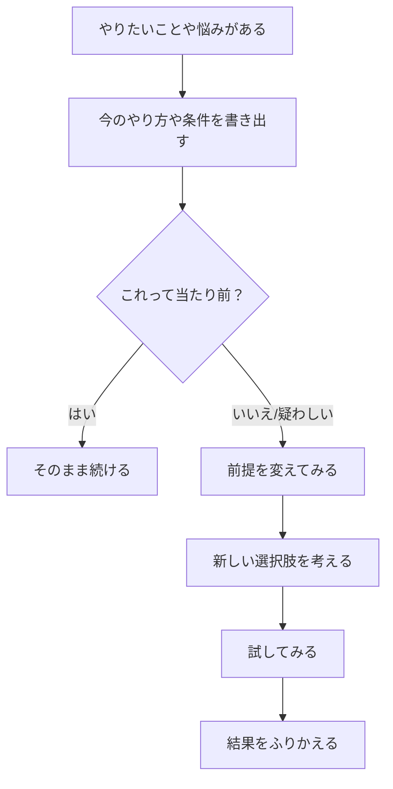

「これはこういうものだ」って、いつのまにか思い込んでいることってない？  
実は、その思い込みをちょっとゆるめるだけで、見える景色が変わることがあるんだ。

---

# 「仮定」を疑ってみる

たとえば、  
- 通勤は毎日しなきゃいけない  
- カレーはカレー粉で作るもの  
- プレゼントは新しいものを買うもの  

…これ、実は全部「自分が勝手にそうだと思っている仮定」かもしれない。  
一度「ほんとにそう？」って自分に問いかけてみると、面白い発想が浮かんでくる。

---

# 仮定を変えるとどうなる？

「通勤は毎日」の仮定を変えてみると…  
→ 週に数日は家でできる仕事スタイルになるかもしれない。  

「カレーはカレー粉」の仮定を変えると…  
→ 野菜だけを煮込んで塩だけで仕上げる、あっさりスープカレーになるかもしれない。  

こうやって前提を外すと、思いつくアイデアの幅がぐっと広がる。

---

# どうやって前提を見つける？

ポイントは「それって当たり前？」と聞くこと。  
自分がやっていること、周りがやっていることを、あえて疑ってみるんだ。  

- 誰が決めた？  
- いつからそうしてる？  
- もしそれをやめたらどうなる？  

この質問を繰り返すと、自分が握りしめていた前提が浮かび上がってくる。

---

# 図にしてみると…



---

# プログラムっぽく書くと…

```python:python
# 解決したいことや悩みを決める
問題 = "やりたいことや困っていること"

# 今の前提ややり方をリストにまとめる
前提リスト = ["毎日通勤しなきゃいけない", "カレーはカレー粉で作る", "プレゼントは新しいもの"]

# 前提を一つずつ疑ってみる
for 前提 in 前提リスト:
    print(f"前提を考える：{前提}")
    
    # 仮に「当たり前じゃないかも」と思ったら
    if 前提 != "絶対に正しい":  # ざっくりの判断
    
        # 前提を変えてみる例
        新しい前提 = "別のやり方や条件を考える"
        
        print(f"仮定を変えてみる：{新しい前提}")
        
        # 新しい方法を試す
        print("新しい方法を試してみよう！")
        
        # 結果をふりかえって判断（ここはイメージ）
        print("結果をふりかえろう")

print("前提を変えることは、新しい発見のチャンス")
```

```prolog:prolog
% 目的：新しい解決策を見つけるために前提を疑う

やりたいこと(問題).

前提(今のやり方).

% 前提を疑うルール
疑う(前提) :-
    当たり前ではない(前提).

% 新しい前提を作るルール
変える(前提, 新しい前提) :-
    疑う(前提),
    別の方法(新しい前提).

% 解決策を探すルール
試す(新しい前提) :-
    変える(_, 新しい前提),
    新しい案(新しい前提).

% 成功したら振り返る
振り返る :-
    試す(新しい前提),
    結果がよければ成功,
    そうでなければ別の前提を疑う.
``` 

---

# さいごに

仮定を変えるって、ちょっと怖いことのように思えるけど、  
実は「自分に新しいチャンスをあげる」ことでもあるんだ。  

今日のどこかで、ひとつだけ前提をゆるめてみよう。  
その一歩が、今まで見えなかった道につながっているかもしれない。

