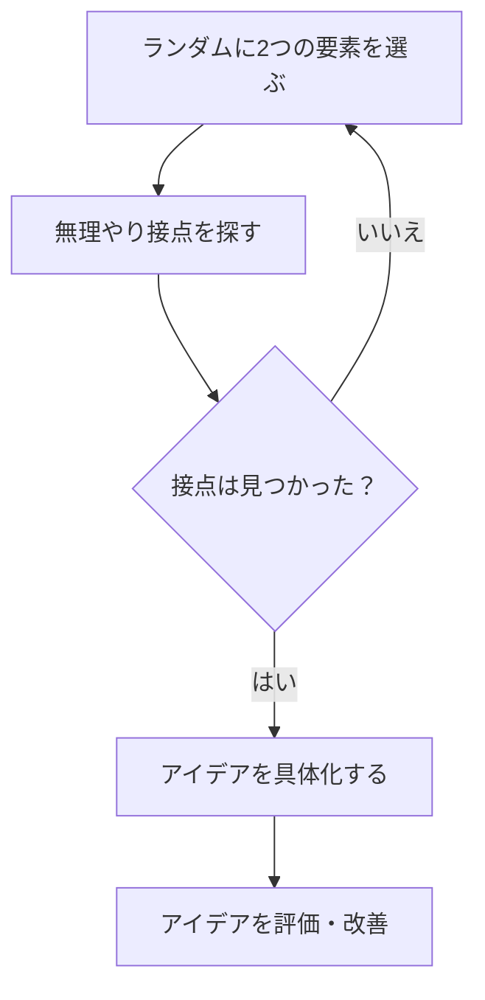

# 「え？それとこれを合わせるの？」から始まる発想法

「全然関係ないもの同士を、あえてくっつけてみる」  
これが「強制的連想」という発想法なんだよね。  

ふつうは「つながらないものは別物」と思っちゃうけど、  
そこをあえて無理にでも結びつけると、不思議なくらい新しいアイデアが出てくる。  

---

# どうやってやるの？

1. **関係なさそうなものを選ぶ**  
   - たとえば「猫カフェ」と「宇宙開発」  
   - 「回転寿司」と「ヨガ」  
2. **無理やり共通点を探す**  
   - 猫カフェと宇宙 → 宇宙服着た猫のイベント？  
   - 回転寿司とヨガ → 回転するポーズでバランスを取るエクササイズ？  
3. **出てきた発想をふくらませる**  
   - 最初はおかしくても、後から現実的な形にすればOK

---

# ポイントは「真面目にふざける」

ただ笑えるだけのネタで終わらせないで、  
「これを実際に使える形にすると…？」と考えてみるのがコツ。  

たとえば、医療とゲームを無理やりつなげたら、  
治療の進捗がレベルアップ表示されるアプリができるかもしれない。  

---

# 使える場面

- 新しいサービスを考えるとき  
- 既存の企画に行き詰まったとき  
- チームでブレストしてもネタ切れしたとき  

---

# 試してみよう


```python:python
def 強制的連想(要素リスト):
    ループ:
        要素1, 要素2 = ランダムに2つ選ぶ(要素リスト)
        接点 = 無理やり接点を探す(要素1, 要素2)
        もし 接点 が 見つかったら:
            アイデア = 発想をふくらませる(接点)
            もし アイデアを評価(アイデア) == True:
                return アイデア
        それ以外:
            続ける

def ランダムに2つ選ぶ(リスト):
    import random
    return random.sample(リスト, 2)

def 無理やり接点を探す(e1, e2):
    # ここに無理やり共通点や接点を探すロジックを入れる
    pass

def 発想をふくらませる(接点):
    # 接点をもとにアイデアを具体化する処理
    pass

def アイデアを評価(アイデア):
    # アイデアの面白さや実用性をざっくり判断する処理
    return True  # 仮の判定
```
```prolog:prolog
% Prolog風：強制的連想の例

% 要素ペアをランダムに選ぶ
選ぶ(リスト, 要素1, 要素2) :-
    random_select(要素1, リスト, 残り),
    random_select(要素2, 残り, _).

% 無理やり接点を探す（例: 共通キーワードがあるか）
接点を探す(要素1, 要素2, 接点) :-
    共通キーワード(要素1, 要素2, 接点).

% アイデアをふくらませる（接点に基づき）
アイデアを作る(接点, アイデア) :-
    アイデア = ['接点' と '関連' の組み合わせによるアイデア'].

% 強制的連想のメイン処理
強制的連想(リスト, アイデア) :-
    選ぶ(リスト, E1, E2),
    接点を探す(E1, E2, 接点),
    接点 \= [],
    アイデアを作る(接点, アイデア).
```

---

# おわりに
強制的連想は、一見ムチャでもいいんだよね。
「そんなのムリ」と切り捨てる前に、一度くっつけてみる。
その“ムリやり”が、意外な未来の種になるかもしれない。
