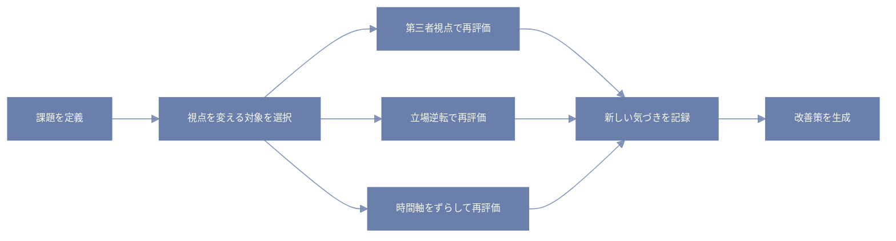

僕らはふだん、コードを書くときも生活するときも、ほとんど「自分の視点」からしか世界を見てない。  
でも、少し立ち位置を変えるだけで、まったく別の景色が見えることがある。

---

# 日常の小さな例
ある日、コーヒーを飲みながら作業してて、なんとなくマグカップを反対側に持ち替えてみた。  
そしたら、普段見えなかったイラストが現れて、「あれ、こんな絵ついてたんだ…」って気づいた。  

ほんのちょっとの角度の変化で、新しい情報が入ってくる。  
この「角度の変化」が、思考にも応用できる。

---

# 視点を変えるための3つの方法
1. **他者の視点になる**  
   自分の書いたコードをレビューする同僚になったつもりで読む。  
   すると「ここ、変数名わかりにくいな…」など、今まで気づかなかった改善点が見えてくる。

2. **立場を逆転させる**  
   使う人ではなく、作る人の視点に立つ。  
   逆に、開発者視点ではなく、ユーザー視点で使い勝手を確認する。  

3. **時間軸をずらす**  
   未来の自分が今のコードを触るとき、「何が理解の障壁になるか」を想像する。  
   あるいは、過去の自分ならどこでつまずくかを考える。

---

# ミニワーク：視点チェンジしてみよう
1. 今の課題を1つ書き出す  
2. 「第三者だったらどう見る？」を書き出す  
3. 「相手側から見たら？」も書き出す  
4. 「半年後の自分だったら？」も考えてみる  

たったこれだけで、新しい発想が出てくることがある。

---

# エンジニア的視点チェンジの流れ（フローチャート）

こうやって思考を構造化しておくと、「ただの気分転換」ではなく、
再現性のある視点チェンジができるようになる。

日常でも、バグ調査でも、人間関係でも。
視点を変えるだけで、世界の見え方がガラッと変わるんだ。

#疑似言語とprolog
```python:python
def 視点チェンジ(課題):
    視点リスト = ["第三者視点", "立場逆転", "未来視点", "過去視点"]
    気づき集 = []

    for 視点 in 視点リスト:
        新しい見方 = 視点から考える(課題, 視点)
        気づき集.append(新しい見方)

    改善案 = 最適解を選ぶ(気づき集)
    return 改善案

def 視点から考える(課題, 視点):
    if 視点 == "第三者視点":
        # 他人の立場で課題を見るイメージ
        return f"第三者の視点で見た「{課題}」の新しい発想"
    elif 視点 == "立場逆転":
        # 立場を逆にした考え方
        return f"逆の立場から見た「{課題}」の気づき"
    elif 視点 == "未来視点":
        # 未来の自分が見る目線
        return f"未来の自分が考えた「{課題}」の改善点"
    elif 視点 == "過去視点":
        # 過去の自分の目線で振り返る
        return f"過去の自分ならこう考えそうな「{課題}」"
    else:
        return "未知の視点"

def 最適解を選ぶ(気づき集):
    # ここでは単純に最初の案を選ぶ例
    if 気づき集:
        return 気づき集[0]
    else:
        return None


# 使い方の例
課題 = "バグが頻発するコードの改善"
案 = 視点チェンジ(課題)
print(f"改善案: {案}")
```

```prolog:prolog
% 課題の視点変換ルール
視点変換(課題, 第三者, 見方) :-
    他者の立場で考える(課題, 見方).
視点変換(課題, 立場逆転, 見方) :-
    立場を逆にして考える(課題, 見方).
視点変換(課題, 未来, 見方) :-
    未来の自分の視点で考える(課題, 見方).
視点変換(課題, 過去, 見方) :-
    過去の自分の視点で考える(課題, 見方).

% 改善案を導くメインルール
改善案(課題, 案) :-
    見方リスト = [第三者, 立場逆転, 未来, 過去],
    findall(見方, (member(視点, 見方リスト), 視点変換(課題, 視点, 見方)), 気づき集),
    最適解選択(気づき集, 案).
```
