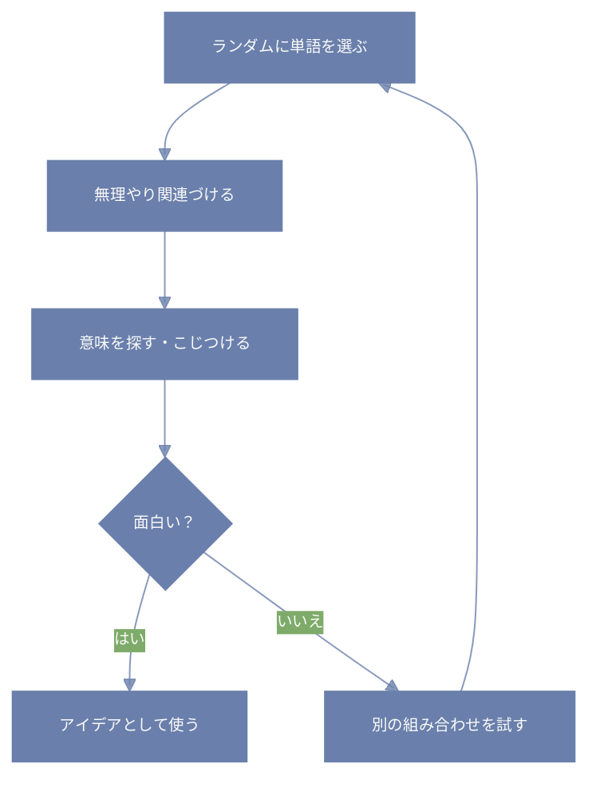

「これとあれ、全然関係ないよね？」  
…と思うもの同士を、あえてくっつけてみる。  
それが「無関係なものを関連づける」発想法。

---

# これは何のためにやるの？

普段は交わらない二つの要素を、あえて同じ場所に置くと、脳がちょっと混乱する。  
すると、「どうやったらつながるかな？」と勝手に連想を始めてくれる。  
その過程で、ふっと面白い発見が出てくることがあるんだ。

---

# やり方の例

- 辞書やネットから適当に単語を拾って、今のテーマと無理やり組み合わせる  
- 違うジャンルのものを同じ文脈で考えてみる  
- 「もし○○が××だったら？」という仮想設定で遊ぶ  

---

# 実際にやってみる

たとえば、「洗濯物」と「プログラムのバグ」って全く関係なさそう。  
でも少し考えると――  
「どちらも放っておくと増えるし、定期的に片付けないと大変になる」  
…なんて似てる部分が見えてくる。

これくらいの軽いこじつけでもOK。  
むしろ意味がないような組み合わせほど、面白いひらめきが生まれることもある。

---

# ちょっとしたコツ

- 最初から正解や意味を求めない  
- 「変だな」と思うくらいの組み合わせを選ぶ  
- 後で使えそうな形に整えればいい

---

# この発想法の手順

```python:python
# テーマとランダムな単語を組み合わせてアイデアを作る

def 無関係なものを関連づける(テーマ):
    while True:
        ランダム単語 = ランダムに単語を選ぶ()
        アイデア = 関連づけを試す(テーマ, ランダム単語)
        
        if アイデアは面白い(アイデア):
            return アイデア
        # 面白くなければ、また別の単語で挑戦する

def ランダムに単語を選ぶ():
    # 辞書やネットなどからランダムに単語を取得する処理
    pass

def 関連づけを試す(テーマ, 単語):
    # テーマと単語の共通点や関連しそうな点を探す
    # こじつけも歓迎！無理やり結びつけてみる
    アイデア = f"{テーマ}と{単語}の共通点や関係性を探る"
    return アイデア

def アイデアは面白い(アイデア):
    # アイデアが面白いかどうかを判断（感覚的でOK）
    # ここは人間の判断に任せる部分
    return True  # 例として常にTrueにしておく
```
```prolog:prolog
% 無関係な要素を関連づけるルール
関連づけ(テーマ, 無関係な単語, アイデア) :-
    特徴(テーマ, T特徴),
    特徴(無関係な単語, W特徴),
    共通点(T特徴, W特徴),
    アイデアを作る(テーマ, 無関係な単語, アイデア).

```

