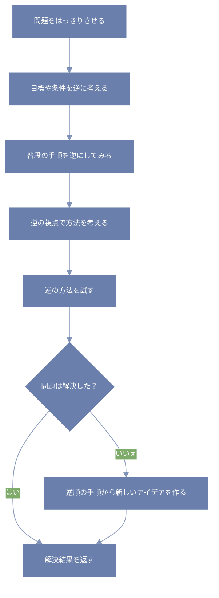

:::details この記事が役立つ人
- 様々な思考法について学んで実践したい人
- 駆け出しのエンジニア
:::

こんにちは。  
今回は「ラテラル思考」の中でも特に身近で使いやすい「逆転思考」について、じっくり話してみたいと思います。  

---

## 逆転思考ってなんだろう？  

簡単にいうと、問題や課題を解決するときに「いつもと逆の方向から考えてみる」方法のことです。  

たとえば、「どうやったらもっと早くできるかな？」と考えるのではなく、あえて「どうやったらもっと遅くできるかな？」と考えてみる。  

これが逆転思考の入り口です。  

なぜこんな逆のことをするの？と疑問に思うかもしれませんね。  

でも、普段は見えにくい視点や、気づかない盲点に気づけるチャンスが増えるんです。  

---

## なぜ逆転思考は効果的なの？  

普段の思考は「慣れ」や「習慣」に縛られています。  

いつも同じ順番で同じやり方をしていると、そこから抜け出すのは難しいもの。  

逆転思考は、その「慣れ」をわざと壊すことで、新しいアイデアの種を蒔きます。  

たとえば、いつも仕事の手順を「A→B→C」と進めているなら、これを「C→B→A」と逆にしてみる。  

すると、ふだん気づかなかった手順の無駄や、もっと良いやり方が見えてくることもあるんです。  

---

## 具体的にどうやるの？  

### 1. 問題を「反対」から考えてみる  

たとえば「資料を早く作るには？」なら、逆に「資料を遅く作るには？」と考えてみる。  

「遅くするにはどんな行動をする？」をリストアップしてみると、逆説的に「やってはいけないこと」や「無駄なこと」が見えてきます。  

これを避けるのがポイント。  

### 2. 順番を逆にしてみる  

普段の作業手順を逆からやってみる。  

例えば、書類を仕上げる順番や、コードを書く順序を変えてみると、新しい発見があるかもしれません。  

### 3. 常識や固定観念を疑う  

「こうするのが当たり前」と思っていることをあえて疑ってみる。  

たとえば「必ず会議は30分以内に終わらせる」と決めていたら、逆に「会議はあえて1時間にしてみる」とか。  

そうすることで、新しいバランスや効率のヒントが見つかることも。  

---

## 逆転思考を使うときのコツ  

- 完全に真面目にやらなくていいです。  

ちょっと遊び感覚で、「もしも～だったら？」と想像してみるのが大事。  

- やってみて面白い！と思えることを優先。  

硬く考えすぎると続かないので、軽い気持ちで楽しんでみてください。  

- ひとりで考えにくいときは、誰かと話しながらやってみるのもおすすめ。  

違う人の逆転案が聞けると、さらに広がりが生まれます。  

---

## 逆転思考の効果例  

例えば、僕が昔仕事で時間がかかっていた資料作成。  

いつも「どうやったら早くできるか」ばかり考えてたけど、逆に「どうやったらもっと遅くなるか？」と考えてみた。  

すると、無駄に細かく確認しすぎていたり、余計な手順を踏んでいたことがわかりました。  

そこを減らす工夫をしたら、結果的にずいぶん効率がアップしました。  

---

## まとめ  

逆転思考は、思考の枠を壊して、新しい視点を手に入れる魔法みたいなもの。  

疲れたとき、行き詰まったとき、ちょっと立ち止まって「逆から見てみよう」と思うだけで、心も頭もふんわり軽くなります。  

無理せず、楽しみながら使ってみてくださいね。  

---

【使い方イメージ】  



```python:python
def 逆転思考(問題):
    # まず、問題の目標や条件を逆にして考えてみる
    逆の問題 = 目標や条件を逆にする(問題)
    
    # 次に、普段のやり方や手順を逆から見てみる
    逆順の手順 = 手順を逆にする(問題.手順)
    
    # 逆の問題や逆順の手順でできる方法を探してみる
    逆の方法たち = 逆の視点で方法を考える(問題.方法リスト)
    
    # 逆の方法を順に試してみて、解決できたらそれを返す
    for 方法 in 逆の方法たち:
        結果 = 方法.やってみる()
        if 解決できたか(結果):
            return 結果
    
    # もしまだ解決しなければ、逆から考えた手順をもとに新しいアイデアを作る
    新しいアイデア = 新しい考えを作る(逆順の手順)
    
    return 新しいアイデア

def 目標や条件を逆にする(問題):
    # 例えば「早く終わらせる」を「遅く終わらせる」に変えてみる
    新しい問題 = 問題.コピー()
    新しい問題.目標 = 逆にする(問題.目標)
    新しい問題.条件 = 逆にする(問題.条件)
    return 新しい問題

def 手順を逆にする(手順リスト):
    # 手順の順番をひっくり返すだけ
    return 手順リスト[::-1]

def 逆の視点で方法を考える(方法リスト):
    逆方法リスト = []
    for 方法 in 方法リスト:
        逆方法 = 方法.逆のやり方を考える()
        逆方法リスト.append(逆方法)
    return 逆方法リスト

def 解決できたか(結果):
    # 結果が問題を解決できているかどうかを判断
    return 結果.成功かどうか()

def 新しい考えを作る(手順リスト):
    # 逆の手順をもとにアイデアを生み出す（ここは自由に工夫できる）
    アイデア = []
    # たとえば手順の組み合わせを変えるなど
    return アイデア
```

```prolog:prolog
% 逆転思考のルール

逆転思考(問題, 解決策) :-
    逆問題(問題, 逆の問題),
    逆手順(問題, 逆順の手順),
    逆方法(問題, 逆の方法リスト),
    試す方法(逆の方法リスト, 解決策),
    ( 解決策 \= none -> true
    ; 新しいアイデア(逆順の手順, 解決策)
    ).

% 問題の目標や条件を逆にする
逆問題(問題, 逆の問題) :-
    目標を逆にする(問題.目標, 逆の目標),
    条件を逆にする(問題.条件, 逆の条件),
    逆の問題 = 問題,
    逆の問題.目標 = 逆の目標,
    逆の問題.条件 = 逆の条件.

% 手順を逆順にする
逆手順(問題, 逆順の手順) :-
    逆順の手順 = reverse(問題.手順).

% 逆の方法リストを作る
逆方法(問題, 逆の方法リスト) :-
    maplist(逆の方法を作る, 問題.方法リスト, 逆の方法リスト).

% 逆の方法を試す
試す方法([], none).
試す方法([方法|残り], 解決策) :-
    実行(方法, 結果),
    ( 解決判定(結果) -> 解決策 = 結果
    ; 試す方法(残り, 解決策)
    ).

% 新しいアイデアを作る（例として空のリストを返す）
新しいアイデア(_逆順の手順, []).
```
