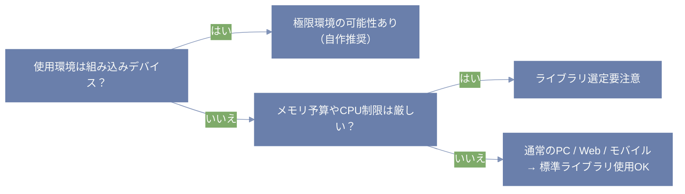

こんにちは、zoldofです。  
今回は「時刻差分の処理って、ライブラリ使うとメモリ食うよね？」という話から、ちょっとマニアックにメモリの話や極限環境の話に広げてみようと思います。

✅ 判断軸と優先度一覧（評価軸）
| 判断軸               | 優先度 | 理由                        |
|----------------------|--------|-----------------------------|
| 実行時間の短さ       | 高     | リアルタイム処理に直結      |
| メモリ使用量の少なさ | 高     | 組込み・省リソース環境で重要 |
| コードの簡潔さ       | 中     | 拡張性・開発効率に影響       |
| ライブラリの機能性   | 低〜中 | 複雑な処理には重要          |

---

# ⏳ 実行時間とメモリ、どこまでなら許容される？

いろんなライブラリで時刻差分をとったときの実測値がこちら。

| ライブラリ | 実行時間 | メモリ（現時点） | メモリ（ピーク） | 
|------------|----------|-------------------|-------------------|
| datetime   | 0.0038秒 | 615,243B          | 617,794B          | 
| dateutil   | 0.0155秒 | 1,395,562B        | 1,395,962B        | 
| pandas     | 0.6152秒 | 30,851,005B       | 30,885,673B       | 

正直、pandasは時刻処理には重すぎる。  
でも、じゃあ600KB使ってるdatetimeはどうなの？っていう話。

---

# 🧠 実用用途での「許容される重さ」とは？

これ、アプリに組み込む目的次第で判断が変わります。

| 使用環境         | 許容されるメモリ     | 備考 |
|------------------|----------------------|------|
| Web API / PCアプリ | 数MB〜数百MB        | ライブラリ使用OK。速度か可読性を優先 |
| モバイルアプリ     | 数MB以内が望ましい   | 低スペック端末考慮。重い処理は非同期で |
| 組込み・IoT       | 数KB〜数MB          | ライブラリ非推奨。自作ロジック推奨 |
| 競技プログラミング | 数百MB以内           | 計算量とメモリ最適化が最重要 |

✅ メモリ効率の評価観点（実用重視）
| 観点                        | 説明                                      | 優先度 |
|-----------------------------|-------------------------------------------|--------|
| ライブラリの導入コスト       | `datetime` は標準組み込みで非常に軽い     | ★★★★★ |
| 実行時のピークメモリ        | 数百KBは誤差レベル                        | ★★★★☆ |
| 自作による節約効果（数KB）  | 保守性とのトレードオフ                    | ★★☆☆☆ |

---

# 📚️ どのライブラリを選べばいい？

✅ 極限環境の定義（組込み向け）
| 種類           | 内容・例                                |
|----------------|-----------------------------------------|
| 極小メモリ      | RAM: 数十KB（Arduino Unoなど）           |
| 低クロックCPU   | 数MHz〜100MHz（8bitマイコンなど）        |
| 電力制限        | 電池・太陽電池（ドローン等）             |
| リアルタイム制御 | 数ms以下の応答（自動車ECUなど）         |
| ROM制限         | 数百KBしかない環境                       |

✅ 用途別の許容基準（簡潔版）
| 用途                   | 実行時間目安 | メモリ制約     | 推奨ライブラリ             |
|------------------------|--------------|----------------|----------------------------|
| 組込み系・IoT          | ～0.01秒     | ～1MB           | `datetime`（最小構成）     |
| Web API（バックエンド）| ～0.1秒      | ～10MB          | `datetime` or `dateutil`   |
| データ分析・バッチ処理 | ～数秒以上可 | 数十～数百MB可 | `pandas`                   |
| 大量ログ処理           | 件数に依存    | 数百MB以上可    | `pandas` + 並列処理可      |

✅ ライブラリ使用 vs 自作判断ガイド
| 使用条件                 | ライブラリ使用 | 自作検討     |
|--------------------------|----------------|--------------|
| スマホ・PCアプリ         | ✅ 使用OK       | ❌ 不要       |
| Webバックエンド           | ✅ 使用OK       | ❌ 不要       |
| 組込み（ESP32など）      | ◯ 条件付き      | ◯ 検討あり     |
| MicroPythonなど軽量環境   | △ モジュール制限 | ✅ 有効       |

---

# 🧩 競技プログラミングは「極限環境」か？

結論からいうと Yes, but different.

- **組み込み環境**：物理的に使えないものが多い  
- **競プロ**：制限内で“どこまで速く・軽く”できるかが勝負

たとえば、競プロで`datetime`を使うよりも、  
「時・分・秒を全部秒に直して差をとる」ような**自作関数**の方が速くて軽いことも多い。

✅ 競プロで重視される「極限性」
| 評価軸   | 組み込み系               | 競技プログラミング                        |
| ----- | ------------------- | -------------------------------- |
| RAM制限 | 数KB〜MB（**絶対的に小さい**） | 256MB〜1GB程度（**相対的に小さい**）         |
| 実行時間  | 常時リアルタイム（ms未満）      | 問題ごとに**1〜3秒以内**                  |
| 実行回数  | 常駐型で継続動作            | 数回の試行が限界（**1問1発勝負**）             |
| ライブラリ | そもそも使えない            | 標準ライブラリは**使えることが多い**が、外部ライブラリはNG |

---

## 🔍 自作関数と標準ライブラリ、どっちが可読性が高いのか？

- **自作関数（20行・4関数）**：処理が見えるので可読性が高くなることもある  
- **datetime + timedelta（9行・1関数）**：学習コストが低く、明快

> 可読性は単なる「行数の短さ」では測れない。  
> 「その関数が何をしているか」がぱっと見でわかるかどうかが重要。

✅ 可読性チェックリスト（実用向け）
| チェック項目                | OKの例                            |
|-----------------------------|-----------------------------------|
| 関数名が処理内容を示す      | `calc_time_diff` など             |
| 関数が単一の目的に絞られている| 差分計算と表示が分離されている     |
| 流れが上から自然             | 上から読むと意味が追える          |
| 説明なしでも読める           | マジックナンバーや謎の if なし    |
| コメント不要で理解できる     | 命名と構成で意図が伝わる          |

---

# 🔚 まとめ

- ライブラリを使う＝重い、ではなく  
  「**状況に応じて最適化ポイントが違う**」だけ。
- メモリを極限まで削る必要があるのは、  
  **本当に制限の厳しい環境（組み込み・競プロ）** だけ。
- 可読性の指標は、**行数ではなく処理の明瞭さ**。
- 「自作 vs 標準」は、**速度・容量・読みやすさのバランス**で選ぼう。

---

# ☁ おまけ：自作の時刻差分関数を例に

- [時刻差分のアルゴリズム：日をまたぐ時間差も考慮した正確な計算方法](https://zenn.dev/zoldof/articles/8087839369b6ad)

---

# ✍ 最後に

この記事が、ライブラリ選定やコード設計のヒントになればうれしいです。  
使いどころによって最適な選択肢は変わるし、  
そこを言語化しておくのって結構大事かも。
